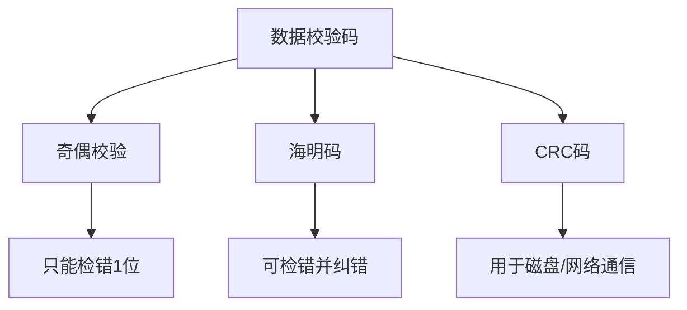

# 数据表示与校验码

## 1. 进制转换
- **R进制转十进制**：按权展开法。
- **十进制转R进制**：短除法（取余）。
- **二进制与八/十六进制**：分组转换（3位/4位）。

## 2. 原码、反码、补码、移码
| 码制 | 正数 | 负数 | 备注 |
| :--- | :--- | :--- | :--- |
| **原码** | 符号位0+绝对值 | 符号位1+绝对值 | 0有[+0]和[-0]，范围：$-(2^{n-1}-1) \sim 2^{n-1}-1$ |
| **反码** | 同原码 | 符号位不变，数值位取反 | 0有[+0]和[-0]，范围同原码 |
| **补码** | 同原码 | 反码 + 1 | **0唯一**，范围：$-2^{n-1} \sim 2^{n-1}-1$ (多出一个负数) |

> **🔥 考点提醒 (Q1)**：8位补码范围是 **-128 ~ 127**。原码和反码是 **-127 ~ 127**。

## 3. 浮点数运算
- **公式**：$N = M \times R^E$ 
- **阶码 (E)**：决定浮点数的 **表示范围**（类似于科学计数法中的指数）。
- **尾数 (M)**：决定浮点数的 **精度**。
- **符号位**：决定正负。

> **🔥 考点提醒 (Q2)**：范围看阶码，精度看尾数。

## 4. 校验码
### 海明码 (Hamming Code)
- **原理**：利用多位校验位形成**多组奇偶校验**。通过多组校验结果的交集，可以精确定位出错的比特位。
- **核心能力**：检错并**纠错**。
- **码距**：海明码通过增大**码距**（Code Distance）来实现纠错。

> **🔥 考点提醒 (Q3)**：海明码的核心是多组奇偶校验和增大码距。

### 循环冗余校验码 (CRC)
- **原理**：模2除法。
- **应用**：网络传输检错。

