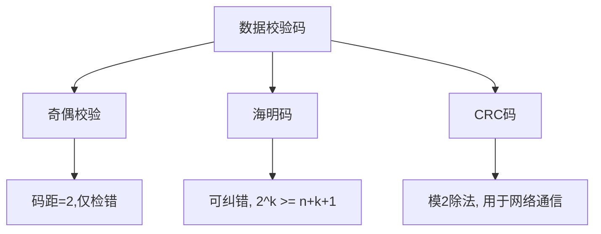

# 数据表示与校验码

## 1. 进制转换
- **R进制转十进制**：按权展开法。
- **十进制转R进制**：短除法（取余）。
- **二进制与八/十六进制**：分组转换（3位/4位）。

## 2. 原码、反码、补码、移码
| 码制 | 正数 | 负数 | 备注 |
| :--- | :--- | :--- | :--- |
| **原码** | 符号位0+绝对值 | 符号位1+绝对值 | 0有[+0]和[-0]，范围：$-(2^{n-1}-1) \sim 2^{n-1}-1$ |
| **反码** | 同原码 | 符号位不变，数值位取反 | 0有[+0]和[-0]，范围同原码 |
| **补码** | 同原码 | 反码 + 1 | **0唯一**，范围：$-2^{n-1} \sim 2^{n-1}-1$ (多出一个负数) |
| **移码** | 补码符号位取反 | 补码符号位取反 | 用于浮点数阶码，**方便比较大小** |

> **🔥 考点提醒 (Q1)**：8位补码范围是 **-128 ~ 127**。原码和反码是 **-127 ~ 127**。

## 3. 浮点数运算
- **公式**：$N = M \times R^E$ 
- **阶码 (E)**：决定浮点数的 **表示范围**。
- **尾数 (M)**：决定浮点数的 **精度**。
- **运算步骤**：对阶 -> 尾数计算 -> 结果规格化。
> **🔥 考点提醒 (Q2)**：对阶时，**小阶向大阶看齐**，尾数右移。

## 4. 溢出判断
在进行补码加减法时，结果超出表示范围即为溢出。
- **单符号位法**：两个正数相加得负数，或两个负数相加得正数，则溢出。
- **双符号位法（变形补码）**：
    - `00`：结果为正，无溢出。
    - `11`：结果为负，无溢出。
    - `01`：正溢出。
    - `10`：负溢出。

## 4. 非数值表示
### 字符编码
- **ASCII**：7位编码，表示128个字符。
- **汉字编码**：
    - **区位码**：由区号和位号组成。
    - **国标码**：区位码（十六进制）+ `2020H`。
    - **机内码**：国标码 + `8080H`。
    > **转换公式**：机内码 = 区位码 + `A0A0H`。

### 多媒体基础
- **声音**：采样频率、采样精度、声道数。$数据量 = 采样频率 \times 采样位数 \times 声道数 / 8$ (字节/秒)。
- **图像**：分辨率、位深。$彩色图像数据量 = 宽 \times 高 \times 颜色位数 / 8$。

## 5. 校验码
### 海明码 (Hamming Code)
- **校验位个数公式**：$2^k \ge n + k + 1$ (其中 $n$ 为信息位，$k$ 为校验位)。
- **能力**：检错并**纠错**。码距为3时可纠1位错。

### 循环冗余校验码 (CRC)
- **原理**：模2除法。计算时，生成多项式决定了除数。
- **应用**：仅能检错，不能纠错。常用在网络传输中。

