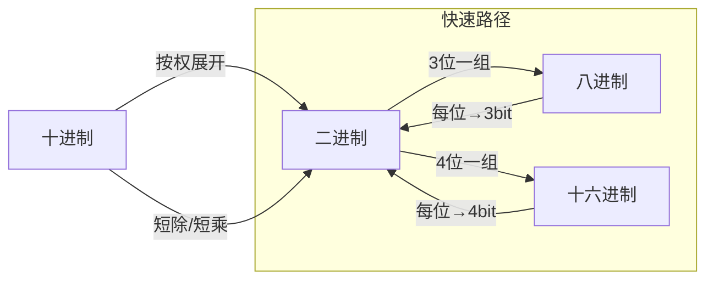
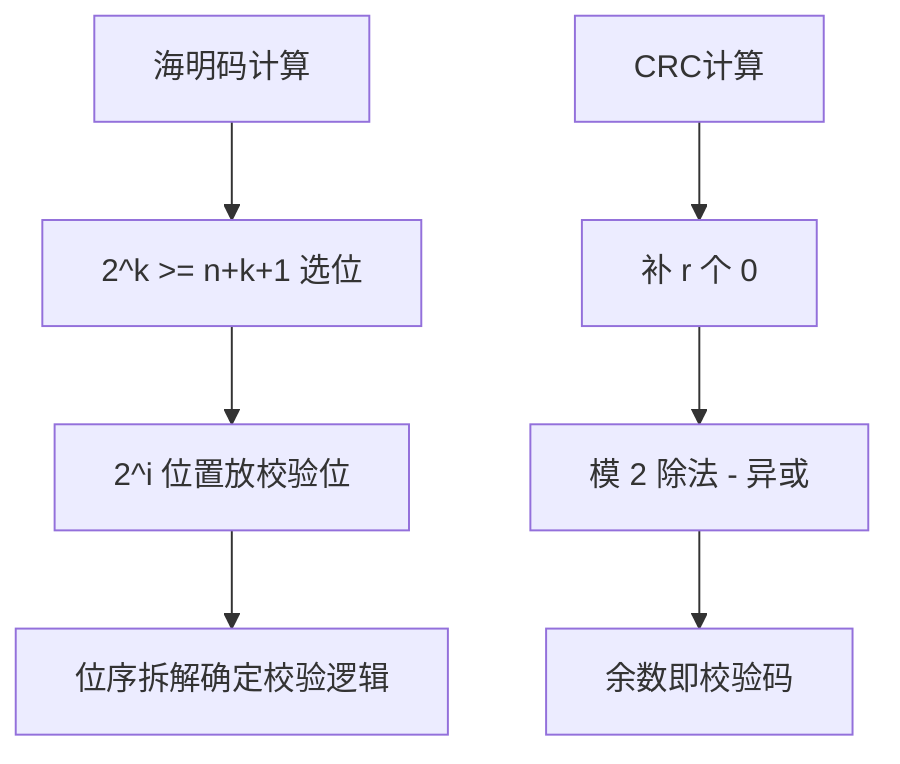

# 数据表示与校验码

## 1. 进制转换

### 1.1 基本概念

**进制 (Radix)**：用 R 个数码（0～R-1）表示数。常见：

| 进制 | 符号 | 数码 | 例子 |
| :--- | :--- | :--- | :--- |
| 二进制 | B / 下标2 | 0, 1 | `1011B` 或 `(1011)₂` |
| 八进制 | O / 下标8 | 0～7 | `17O` 或 `(17)₈` |
| 十进制 | D / 无后缀 | 0～9 | `13` 或 `13D` |
| 十六进制 | H / 下标16 | 0～9, A～F | `1FH` 或 `(1F)₁₆` |

> **🔥 十六进制对照**：A=10, B=11, C=12, D=13, E=14, F=15

**位权**：第 i 位（从 **小数点左边第 0 位** 起算）的权值为 $R^i$；小数点右侧第 j 位权值为 $R^{-j}$。

```text
十进制 253.625 的位权展开：
  2×10² + 5×10¹ + 3×10⁰ + 6×10⁻¹ + 2×10⁻² + 5×10⁻³
= 200   + 50    + 3     + 0.6       + 0.02      + 0.005
```

---

### 1.2 R 进制 → 十进制：按权展开法

**公式**：

$$
(N)_R = \sum d_i \cdot R^i \quad (\text{整数部分，} i \text{ 从 } 0 \text{ 向右递增})
$$

$$
(N)_R = \sum d_{-j} \cdot R^{-j} \quad (\text{小数部分，} j \text{ 从 } 1 \text{ 向右递增})
$$

#### 例题 1：二进制 → 十进制

`1011.101B` = ?

| 位 | 1 | 0 | 1 | 1 | . | 1 | 0 | 1 |
| :--- | :-: | :-: | :-: | :-: | :-: | :-: | :-: | :-: |
| 权 | 2³ | 2² | 2¹ | 2⁰ | | 2⁻¹ | 2⁻² | 2⁻³ |
| 值 | 8 | 0 | 2 | 1 | | 0.5 | 0 | 0.125 |

**结果**：8 + 2 + 1 + 0.5 + 0.125 = **11.625**

#### 例题 2：十六进制 → 十进制

`2A.8H` = ?

- 整数：`2×16¹ + 10×16⁰` = 32 + 10 = **42**
- 小数：`8×16⁻¹` = 8/16 = **0.5**
- **结果**：**42.5**

#### 例题 3：八进制 → 十进制

`17.4O` = `1×8¹ + 7×8⁰ + 4×8⁻¹` = 8 + 7 + 0.5 = **15.5**

> **🔥 技巧**：二进制小数位权是 **1/2, 1/4, 1/8, 1/16…**（每次减半），比十六进制心算更快。

---

### 1.3 十进制 → R 进制：短除法 / 短乘法

#### 整数部分：短除法（取余，倒序排列）

**步骤**：不断 **除以 R**，记录 **余数**；商为 0 时停止；余数 **从下往上读**。

**例**：13 → 二进制

```text
13 ÷ 2 = 6  ... 余 1  ↑
 6 ÷ 2 = 3  ... 余 0  |
 3 ÷ 2 = 1  ... 余 1  |  从下往上读
 1 ÷ 2 = 0  ... 余 1  ↓

13D = 1101B
```

**例**：255 → 十六进制

```text
255 ÷ 16 = 15 ... 余 15 (F)
 15 ÷ 16 =  0 ... 余 15 (F)

255D = FFH
```

#### 小数部分：短乘法（取整，顺序排列）

**步骤**：不断 **乘以 R**，记录 **整数部分**；小数部分为 0 时停止；整数部分 **从上往下读**。

**例**：0.625 → 二进制

```text
0.625 × 2 = 1.25  → 取整 1  ↓
0.25  × 2 = 0.5   → 取整 0  |  从上往下读
0.5   × 2 = 1.0   → 取整 1  ↓
0.0   停止

0.625D = 0.101B
```

**合例**：13.625D = **1101.101B**（整数短除 + 小数短乘）

> **🔥 考点**：有些小数 **无法精确转换**（如 0.1D → 二进制无限循环），考试通常给 **能除尽** 的数。

---

### 1.4 二进制 ↔ 八进制 / 十六进制：分组转换

**原理**：$2^3 = 8$，$2^4 = 16$，所以二进制可以 **按位分组** 直接映射，**不必先转十进制**。

#### 二进制 → 八进制（3 位一组）

**规则**：从小数点向左右两侧分组，不足 3 位 **补 0**。

```text
  10|111.101|100
=  2 | 7  . 5  | 4   (八进制)

1011101.1011B = 135.54O  （左侧补 0：001|011|101，右侧补 0：101|100）
```

#### 二进制 → 十六进制（4 位一组）

```text
  1011|1110.1011|0000
=   B  |  E  . 9  |  0   (十六进制)

10111110.1011B = BE.BH  （小数侧补 0：1011|0000）
```

#### 八进制 / 十六进制 → 二进制

**每位展开为 3 位 / 4 位二进制**（高位可省略前导 0，但考试建议写全）。

```text
3.7O  →  011 . 111  →  11.111B  （或 011.111B）

A5H   →  1010 0101  →  10100101B
```

#### 八进制 ↔ 十六进制

**经二进制中转**（软考最常用路径）：

```text
17O → 001 111 → 0001 1111 → 1FH
```


```mermaid
flowchart LR
    subgraph 快速路径
        B2[二进制] -->|3位一组| O[八进制]
        B2 -->|4位一组| H[十六进制]
    end
    D[十进制] -->|按权展开| B2
    D -->|短除/短乘| B2
    O -->|每位→3bit| B2
    H -->|每位→4bit| B2
```

---

### 1.5 软考常见题型速查

| 题型 | 方法 | 易错点 |
| :--- | :--- | :--- |
| 任意 R 进制 → 十进制 | 按权展开 | 十六进制 A～F 的值；小数权是 $R^{-j}$ |
| 十进制整数 → R 进制 | 短除取余，**倒序** | 余数顺序写反 |
| 十进制小数 → R 进制 | 短乘取整，**正序** | 与整数部分的顺序规则搞混 |
| B ↔ O / H | 3 位 / 4 位分组 | 忘记在小数两侧 **分别** 补 0 |
| 内存地址大小比较 | 先统一进制（通常转十进制或二进制） | `FFH` > `100O` 需换算后比 |

**心算速记**：

- `F = 1111`，`E = 1110`，`A = 1010`，`8 = 1000`，`4 = 0100`，`2 = 0010`，`1 = 0001`
- 4 位二进制 → 1 位十六进制，是计组/内存题最高频操作

## 2. 原码、反码、补码、移码
| 码制 | 正数 | 负数 | 备注 |
| :--- | :--- | :--- | :--- |
| **原码** | 符号位0+绝对值 | 符号位1+绝对值 | 0有[+0]和[-0]，范围：$-(2^{n-1}-1) \sim 2^{n-1}-1$ |
| **反码** | 同原码 | 符号位不变，数值位取反 | 0有[+0]和[-0]，范围同原码 |
| **补码** | 同原码 | 反码 + 1 | **0唯一**，范围：$-2^{n-1} \sim 2^{n-1}-1$ (多出一个负数) |
| **移码** | 补码符号位取反 | 补码符号位取反 | 用于浮点数阶码，**方便比较大小** |

> **🔥 考点提醒 (Q1)**：8位补码范围是 **-128 ~ 127**。原码和反码是 **-127 ~ 127**。  
> 巩固过关（2026-08-18）：16 位 **-32768～32767**；+13=**0DH**，-13=**F3H**（4 位一组，H 只是进制标记）。详见 [35](../deep-dives/35-complement-pipeline-tutorial.md)。

## 3. 浮点数运算
- **公式**：$N = M \times R^E$ 
- **阶码 (E)**：决定浮点数的 **表示范围**。
- **尾数 (M)**：决定浮点数的 **精度**。
- **运算步骤**：对阶 -> 尾数计算 -> 结果规格化。
> **🔥 考点提醒 (Q2)**：对阶时，**小阶向大阶看齐**，尾数右移。

## 4. 溢出判断
在进行补码加减法时，结果超出表示范围即为溢出。
- **单符号位法**：两个正数相加得负数，或两个负数相加得正数，则溢出。
- **双符号位法（变形补码）**：
    - `00`：结果为正，无溢出。
    - `11`：结果为负，无溢出。
    - `01`：正溢出。
    - `10`：负溢出。

## 4. 非数值表示
### 字符编码
- **ASCII**：7位编码，表示128个字符。
- **汉字编码**：
    - **区位码**：由区号和位号组成。
    - **国标码**：区位码（十六进制）+ `2020H`。
    - **机内码**：国标码 + `8080H`。
    > **转换公式**：机内码 = 区位码 + `A0A0H`。

### 多媒体基础
- **声音**：采样频率、采样精度、声道数。$数据量 = 采样频率 \times 采样位数 \times 声道数 / 8$ (字节/秒)。
- **图像**：分辨率、位深。$彩色图像数据量 = 宽 \times 高 \times 颜色位数 / 8$。

## 5. 校验码
### 5.1 海明码 (Hamming Code)
海明码利用奇偶校验位的叠加来确定**一位错**的位置并纠正。
- **能力**：检错并**纠错**。码距为 3 时可纠 1 位错。
- **深度讲解**：[海明码教程与手算练习](../deep-dives/02-hamming-code-tutorial.md)（合法码字、码距、Hamming(7,4) 完整例题）

#### (1) 确定校验位个数 $k$
公式：$2^k \ge n + k + 1$ ($n$ 为信息位长度，$k$ 为校验位长度)。
- 例：若信息位 $n=4$，则 $2^3 \ge 4+3+1=8$ 成立，故需 3 位校验位。

#### (2) 校验位位置分布
校验位 $P_i$ 必须放在海明码的第 $2^{i-1}$ 位。
- 海明码位序：1, 2, 3, 4, 5, 6, 7...
- 存放内容：$P_1, P_2, D_1, P_3, D_2, D_3, D_4...$

#### (3) 确定校验关系
每个数据位由其位序的二进制拆解决定受哪些校验位管理：
- $D_1$ 在第 3 位 ($3 = 2+1$)：受 $P_2, P_1$ 校验。
- $D_2$ 在第 5 位 ($5 = 4+1$)：受 $P_3, P_1$ 校验。
- $D_3$ 在第 6 位 ($6 = 4+2$)：受 $P_3, P_2$ 校验。
- $D_4$ 在第 7 位 ($7 = 4+2+1$)：受 $P_3, P_2, P_1$ 校验。

**结论**：$P_1$ 负责所有位序二进制末位为 1 的位置 (1, 3, 5, 7)；$P_2$ 负责倒数第二位为 1 的位置 (2, 3, 6, 7)。

---

### 5.2 循环冗余校验码 (CRC)
广泛用于网络传输，采用**模 2 除法**求余数。

#### 计算步骤：
1. **加 0**：若生成多项式为 $G(X) = X^4 + X^3 + 1$，阶数 $r=4$，则在原始数据后补 $r$ 个 0。
2. **模 2 除法**：用补 0 后的数据除以 $G(X)$ 对应的二进制码（11001）。
    - **注意**：模 2 除法不借位，本质是**异或 (XOR)**。
3. **求余**：余数即为 CRC 校验码，替换掉之前补的 0 发送。

> **🔥 考点提醒**：CRC 只能**检错**，不能纠错。生成多项式的阶数决定了余数的位数。


```mermaid
graph TD
    A[海明码计算] --> B[2^k >= n+k+1 选位]
    B --> C[2^i 位置放校验位]
    C --> D[位序拆解确定校验逻辑]

    E[CRC计算] --> F[补 r 个 0]
    F --> G[模 2 除法 - 异或]
    G --> H[余数即校验码]
```

