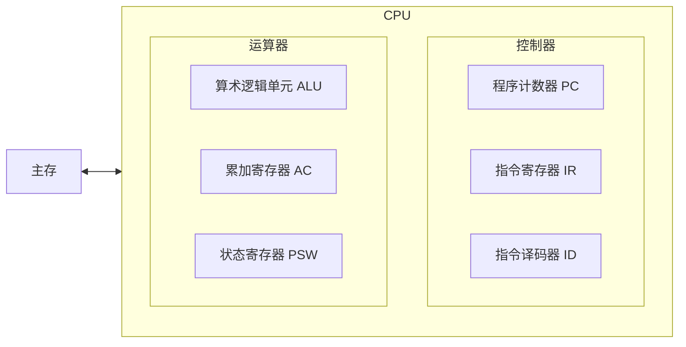

# CPU 架构与指令系统

## 1. CPU 的组成
CPU 由 **运算器** 和 **控制器** 组成。

### 运算器 (ALU + Registers)
- **算术逻辑单元 (ALU)**：执行加减乘除、逻辑运算。
- **累加寄存器 (AC)**：暂时存放运算结果。
- **状态条件寄存器 (PSW)**：存放溢出、零、进位等标志。

### 控制器 (Control Unit)
- **程序计数器 (PC)**：存下一条指令的地址。
- **指令寄存器 (IR)**：存当前正在执行的指令。
- **指令译码器 (ID)**：分析指令的操作码。
- **时序控制逻辑**：提供操作的时序信号。

## 2. 指令系统 (CISC vs RISC)
| 特性 | CISC (复杂指令集) | RISC (精简指令集) |
| :--- | :--- | :--- |
| **指令数量** | 繁多 | 较少 |
| **寻址方式** | 复杂 | 简单 |
| **指令长度** | 不固定 | 固定 |
| **寄存器** | 较少 | 较多 |
| **流水线** | 难以实现 | 易于实现 |
| **应用** | x86 (Intel/AMD) | ARM, Apple Silicon |

## 3. 指令流水线 (Pipelining)
- **原理**：将指令执行分为 取指(IF)、译码(ID)、执行(EX) 等阶段，并行执行。
- **计算公式**：
    - 流水线周期 $\Delta t$ = 最长一段的时间。
    - 执行 n 条指令的总时间：$T = (k + n - 1) \times \Delta t$ （k 为阶段数）。
- **吞吐率**：$TP = n / T$。

```mermaid
gantt
    title 指令流水线执行示意图
    dateFormat  X
    axisFormat %s
    section 指令1
    取指 :a1, 0, 1
    译码 :a2, 1, 2
    执行 :a3, 2, 3
    section 指令2
    取指 :b1, 1, 2
    译码 :b2, 2, 3
    执行 :b3, 3, 4
    section 指令3
    取指 :c1, 2, 3
    译码 :c2, 3, 4
    执行 :c3, 4, 5
```

