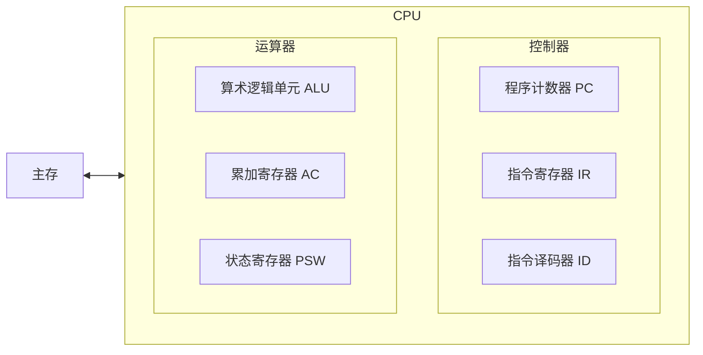

# CPU 架构与指令系统

> 冯诺依曼体系结构专项：[43-von-neumann-architecture-tutorial](../deep-dives/43-von-neumann-architecture-tutorial.md)

## 1. CPU 的组成
CPU 由 **运算器** 和 **控制器** 组成。

### 运算器 (ALU + Registers)
- **算术逻辑单元 (ALU)**：执行加减乘除、逻辑运算。
- **累加寄存器 (AC)**：暂时存放运算结果。
- **状态条件寄存器 (PSW)**：存放溢出、零、进位等标志。

### 控制器 (Control Unit)
- **程序计数器 (PC)**：存下一条指令的地址。
- **指令寄存器 (IR)**：存当前正在执行的指令。
- **指令译码器 (ID)**：分析指令的操作码。
- **时序控制逻辑**：提供操作的时序信号。

### 数据通路与指令执行

不要只按部件名称死记，可把 CPU 看成两条协作路径：

- **数据通路**负责“数据放在哪里、怎么算”：寄存器提供操作数，ALU 执行运算，结果写回指令指定的目标位置，状态寄存器记录零、进位、溢出等特征。
- **控制通路**负责“下一步做什么”：PC 给出取指地址，IR 保存当前指令，译码器与时序逻辑发出控制信号。

一条指令的主干流程为：

```text
PC 给出地址 → 取指到 IR → PC 更新 → 译码 → 读取操作数 → ALU 执行 → 写回结果并更新状态
```

运算结果不一定进入累加器。累加器型指令可写回 `AC`，二地址或三地址指令通常写回指令指定的通用寄存器，也可能按指令要求写入内存。

PC 的变化按控制流区分：

- 顺序执行：PC 通常按指令长度递增。
- 跳转：把跳转目标地址写入 PC。
- 调用：先保存返回地址，再把函数入口写入 PC。
- 返回：把先前保存的返回地址恢复到 PC。

在冯诺依曼结构中，指令和数据都可以存放在同一主存，二进制本身没有天然类型。由 PC 指向并在取指阶段送入 IR 的内容按指令解释；执行指令时按操作数地址读取的内容按数据解释。

> 2026-09-23 回顾：ALU、PC、IR、状态寄存器及运算器/控制器归属辨析较稳；已纠正“结果只能进累加器”“跳转等于返回”和“指令、数据靠不同存储位置区分”三处误区。当前为讲解后理解，待陌生变式抽测。


```mermaid
graph LR
    subgraph CPU
        subgraph Controller [控制器]
            PC[程序计数器 PC]
            IR[指令寄存器 IR]
            ID[指令译码器 ID]
        end
        subgraph ALU_Unit [运算器]
            ALU[算术逻辑单元 ALU]
            AC[累加寄存器 AC]
            PSW[状态寄存器 PSW]
        end
    end
    Memory[主存] <--> CPU
```

## 2. 指令系统 (CISC vs RISC)
| 特性 | CISC (复杂指令集) | RISC (精简指令集) |
| :--- | :--- | :--- |
| **指令数量** | 繁多 | 较少 |
| **寻址方式** | 复杂 | 简单 |
| **指令长度** | 不固定 | 固定 |
| **寄存器** | 较少 | 较多 |
| **流水线** | 难以实现 | 易于实现 |
| **应用** | x86 (Intel/AMD) | ARM, Apple Silicon |

## 3. 指令流水线 (Pipelining)
- **原理**：四步用**四套不同硬件**，同一时刻叠着干**不同指令的不同段**。软考默认**同步流水线**：段间寄存器靠同一时钟交班，所以有固定节拍。快的段做完要空等最慢那段，否则下一段会提前把半成品当成品拿走。
- **计算公式**：
    - 流水线周期 $\Delta t$ = 最长一段的时间（不是各段之和；之和是一条独自做完全程）。
    - 执行 n 条指令的总时间：$T = (k + n - 1) \times \Delta t$ （k 为阶段数）。
- **吞吐率**：$TP = n / T$。
- 巩固过关（2026-08-18）：2/2/4/2 ns 四段、n=100 → $\Delta t=4$ns，$T=412$ns。详见 [35](../deep-dives/35-complement-pipeline-tutorial.md)。


```mermaid
gantt
    title 指令流水线执行示意图
    dateFormat  X
    axisFormat %s
    section 指令1
    取指 :a1, 0, 1
    译码 :a2, 1, 2
    执行 :a3, 2, 3
    section 指令2
    取指 :b1, 1, 2
    译码 :b2, 2, 3
    执行 :b3, 3, 4
    section 指令3
    取指 :c1, 2, 3
    译码 :c2, 3, 4
    执行 :c3, 4, 5
```
