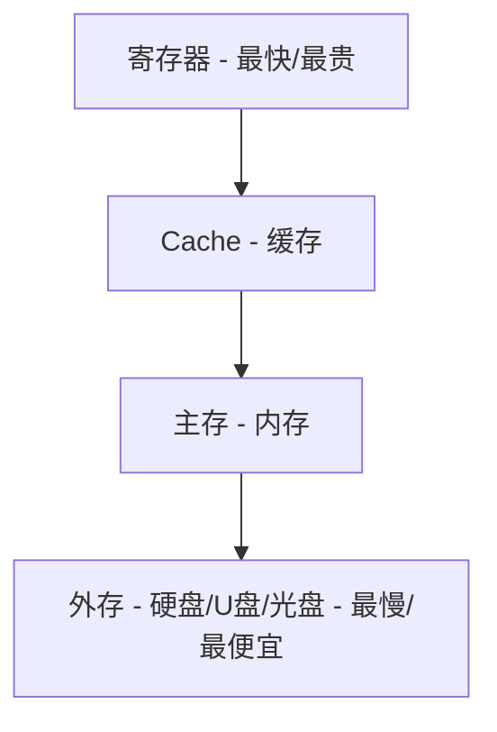
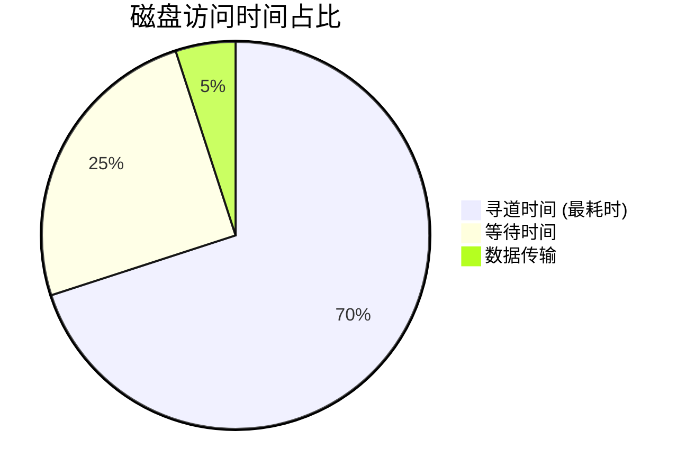

# 存储系统 (Storage Systems)

## 1. 存储层次结构
为了权衡 **速度、容量、成本**，计算机采用多级存储结构。

- **Cache - 主存**：解决 CPU 与主存速度不匹配问题（硬件实现）。
- **主存 - 外存**：解决主存容量不足问题（硬件+OS实现，即虚拟存储）。

## 2. Cache (高速缓存)
Cache 的有效性基于 **局部性原理**：
- **时间局部性**：最近访问的数据可能再次访问。
- **空间局部性**：最近访问的数据其相邻数据可能被访问。

### Cache 与主存的地址映射
1. **直接映射**：主存块只能映射到 Cache 的固定块（简单但碰撞率高）。
2. **全相联映射**：主存块可映射到 Cache 的任意块（灵活但查找慢）。
3. **组相联映射**：前两者折中，主存块映射到固定组的任意块（**考试常考：n路组相联**）。

## 3. 主存 (Main Memory)
### 存储器类型
- **RAM (随机存取存储器)**：掉电丢失（SRAM, DRAM）。
- **ROM (只读存储器)**：掉电不丢失（BIOS 存储在 ROM 中）。

### 存储容量计算 (重点)
**公式**：存储单元数 = 终止地址 - 起始地址 + 1
**内存片数计算**：(总容量) / (单片容量)

> **例题**：内存地址从 `AC000H` 到 `C7FFFH`，单片容量为 `16K*8bit`，若按字节编址，需多少片？
> 1. 计算单元数：`C7FFF - AC000 + 1 = 1C000H`
> 2. `1C000H` 转十进制：$1 \times 16^4 + 12 \times 16^3 = 65536 + 49152 = 114688$
> 3. 或者用 K 表示：`1C000H / 400H = 112K`
> 4. 片数：`112K / 16K = 7片`

## 4. 磁盘调度
磁盘访问时间 = **寻道时间** (Seek Time) + **等待时间** (Rotation Delay)
- **寻道时间**：磁头移动到磁道的时间（影响最大）。
- **等待时间**：磁盘旋转到指定扇区的时间。

