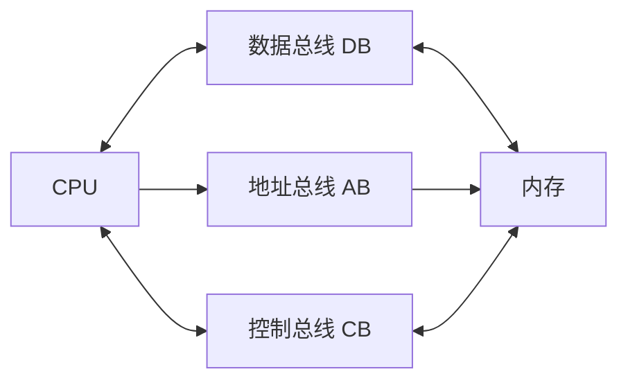

# 总线与系统可靠性

## 1. 总线架构 (Bus Architecture)
总线是连接计算机各部件的公共传输通路。

### 分类 (按位置)
1. **内部总线**：CPU 内部各寄存器、ALU 之间的连接。
2. **系统总线** (核心考点)：连接 CPU、内存、I/O 接口。
    - **数据总线 (DB)**：传输数据，**双向**，宽度决定字长。
    - **地址总线 (AB)**：传输地址，**单向**（CPU -> 外设），宽度决定**寻址范围**（如 32位地址总线可寻址 $2^{32} = 4GB$）。
    - **控制总线 (CB)**：传输控制信号（读、写、中断等）。
3. **外部总线**：设备与设备之间（如 USB, SCSI）。

---

## 2. 系统可靠性 (Reliability)
### 基本指标
- **MTBF** (Mean Time Between Failures)：平均无故障时间，越大越好。
- **MTTR** (Mean Time To Repair)：平均修复时间，越小越好。
- **可靠性 R = MTBF / (MTBF + MTTR)**

### 系统建模计算 (重点)
#### 1. 串联系统 (Series System)
只要有一个组件失效，整个系统就失效。
- **公式**：$R = R_1 \times R_2 \times \dots \times R_n$
- **结论**：可靠性小于任何一个子系统的可靠性。

#### 2. 并联系统 (Parallel System)
只要有一个组件正常，整个系统就正常。
- **公式**：$R = 1 - (1 - R_1) \times (1 - R_2) \times \dots \times (1 - R_n)$
- **结论**：可靠性大于任何一个子系统的可靠性。

#### 3. 混合系统
将复杂系统拆解为串联和并联的组合，分层计算。

---

## 3. 性能评价
- **MIPS** (Million Instructions Per Second)：每秒百万条指令。
- **MFLOPS** (Million Floating-point Operations Per Second)：每秒百万次浮点运算。
- **CPI** (Cycles Per Instruction)：执行一条指令所需的周期数。

> **🔥 考点提醒**：地址总线宽度决定寻址空间大小。20位地址线 -> 1MB，32位地址线 -> 4GB。
