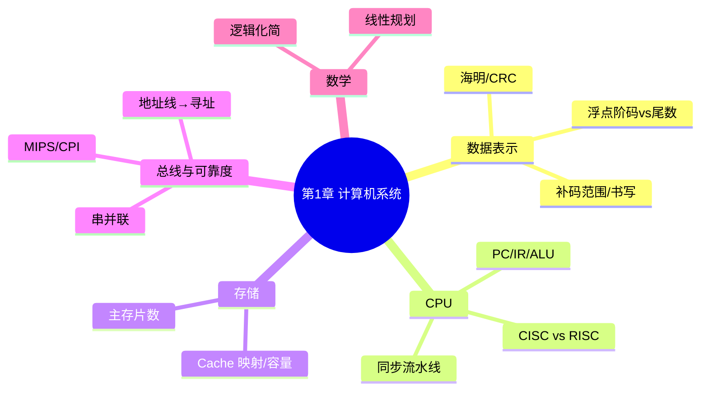

# 计算机系统 — 第 1 章回顾巩固

> 教材第 1 章 · 上午约 **6 分**（概念 + 手算）  
> 摸底：[计组 30 题](../../practice/drills/01-computer-org-30q.md) **10/30**（2026-06）  
> 巩固：[35](../deep-dives/35-complement-pipeline-tutorial.md) · [37](../deep-dives/37-reliability-tutorial.md) · [40 Cache/寻址](../deep-dives/40-cache-addressing-tutorial.md) · 海明 [02](../deep-dives/02-hamming-code-tutorial.md)  
> 来源：2026-08-18～20 按错题回炉（不按教材目录）

---

## 知识地图



---

## 本轮进度（摸底薄弱优先）

| 刀 | 主题 | 状态 | 笔记 |
|----|------|------|------|
| 1 | 补码范围与书写 | ✅ 2026-08-18 | [35](../deep-dives/35-complement-pipeline-tutorial.md) |
| 2 | 流水线 Δt / 总时间 | ✅ 2026-08-18 | 同上 |
| 3 | 并联可靠度 | ✅ 2026-08-19 | [37](../deep-dives/37-reliability-tutorial.md) |
| 4 | Cache 容量/映射、32 位寻址 | ✅ 2026-08-20 | [40](../deep-dives/40-cache-addressing-tutorial.md) |
| 5 | 旋转延迟取半圈 | 🔄 已讲，5400 题未答 | [存储系统](./03-storage-systems.md) |
| 6 | 海明 / CRC | ⬜ | [数据表示](./01-data-representation.md) · [02 海明](../deep-dives/02-hamming-code-tutorial.md) |
| 7 | 逻辑代数、线性规划 | ⬜ 最后过 | [数学基础](./05-math-foundations.md) |

重做目标：计组 30 题 **≥24/30** 再勾 LEARNING_PLAN 6 月第一项。

---

## 已过关口令（刀 1～4）

```text
8 位补码 -128～127；16 位 -32768～32767
+13 = 0DH；-13 = F3H（取反 +1，再 4 位一组）

Δt = 最长一段，不是各段之和
T = (k + n - 1) × Δt
快的段空等 = 等统一时钟交班

并联：先乘「坏」，再 1 减；得数必须高于单个
混合：备份组先并联成一个数，再拿去串联
R = MTBF / (MTBF + MTTR)

Cache 容量 = 组数 × 路数 × 块大小
地址线送门牌号；32 根按字节编址 = 4GB（不要除以 8）
```

---

## 续学

开场白：

```text
继续第 1 章巩固，旋转延迟
```

刀 5 待答：5400 转/分，平均旋转延迟约多少 ms？先算一圈再除以 2。平均取半圈，不是整圈。
