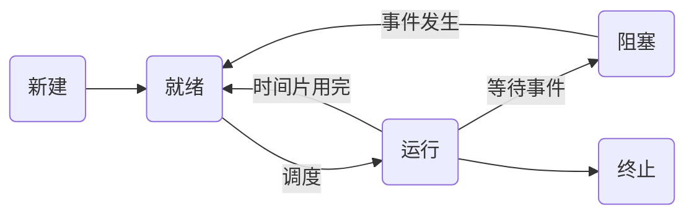

# 进程管理 (Process Management)

进程管理是操作系统的核心功能之一，主要负责处理器的分配和执行。

## 1. 基本概念

- **进程 (Process)**：程序的一次执行过程，是系统进行资源分配和调度的一个独立单位。
- **线程 (Thread)**：进程中的一个实体，是被系统独立调度和分派的基本单位。线程不拥有系统资源，只拥有一点儿在运行中必不可少的资源。

### 进程与线程的区别
| 特征 | 进程 | 线程 |
| :--- | :--- | :--- |
| 资源分配 | 资源分配的单位 | 基本不拥有资源 |
| 调度 | 独立调度单位（传统） | 独立调度单位 |
| 并发性 | 进程间并发 | 线程间并发（更高） |
| 系统开销 | 较大（创建、撤销、切换） | 较小 |

---

## 2. 进程的状态转换

进程在其生命周期中通常处于以下五种状态：

- **就绪 (Ready)**：具备运行条件，等待分配处理器。
- **运行 (Running)**：正在处理器上运行。
- **阻塞 (Waiting/Blocked)**：等待某事件发生（如 I/O 完成）而暂时无法运行。

---

## 3. 进程调度算法

- **先来先服务 (FCFS)**
- **短作业优先 (SJF)**
- **时间片轮转 (RR)**
- **优先级调度算法**
- **高响应比优先 (HRRN)**: 响应比 = (等待时间 + 要求服务时间) / 要求服务时间

---

## 4. 进程同步与互斥 (PV 操作)

这是考试的重点。利用信号量 (Semaphore) 解决生产者-消费者、读者-写者等经典问题。

- **P 操作 (wait)**: `S = S - 1`。若 `S < 0`，则进程阻塞。
- **V 操作 (signal)**: `S = S + 1`。若 `S <= 0`，则唤醒一个等待进程。

---

## 5. 死锁 (Deadlock)

### 死锁产生的四个必要条件
1. **互斥** (Mutual Exclusion)
2. **请求与保持** (Hold and Wait)
3. **不可剥夺** (No Preemption)
4. **循环等待** (Circular Wait)

### 预防与避免
- **银行家算法 (Banker's Algorithm)**：著名的死锁避免算法。
