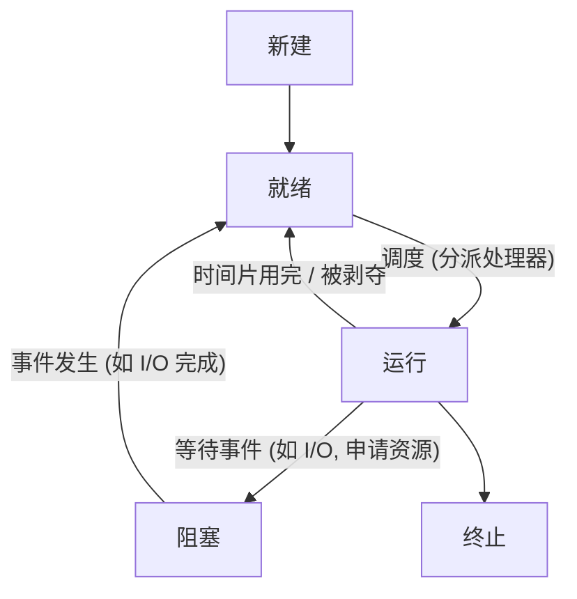
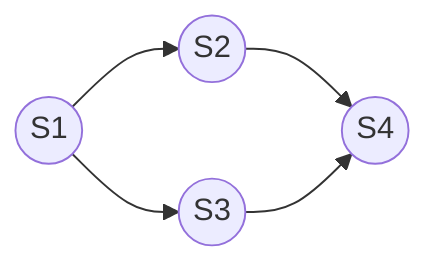

# 进程管理 (Process Management)

进程管理是操作系统的核心功能之一，主要负责处理器的分配和执行。

## 1. 基本概念

- **进程 (Process)**：程序的一次执行过程，是系统进行资源分配和调度的一个独立单位。
- **线程 (Thread)**：进程中的一个实体，是被系统独立调度和分派的基本单位。线程不拥有系统资源，只拥有一点儿在运行中必不可少的资源。

### 进程与线程的区别
| 特征 | 进程 | 线程 |
| :--- | :--- | :--- |
| 资源分配 | 资源分配的单位 | 基本不拥有资源 |
| 调度 | 独立调度单位（传统） | 独立调度单位 |
| 并发性 | 进程间并发 | 线程间并发（更高） |
| 系统开销 | 较大（创建、撤销、切换） | 较小 |

---

## 2. 进程的状态转换 (重点)

进程在其生命周期中通常处于以下五种状态：

```mermaid
graph TD
    New[新建] --> Ready[就绪]
    Ready -- "调度 (分派处理器)" --> Running[运行]
    Running -- "时间片用完 / 被剥夺" --> Ready
    Running -- "等待事件 (如 I/O, 申请资源)" --> Blocked[阻塞]
    Blocked -- "事件发生 (如 I/O 完成)" --> Ready
    Running --> Terminated[终止]
```

### 状态转换陷阱 (软考常考)
- **就绪 -> 运行**：唯一原因是被进程调度程序选中。
- **运行 -> 就绪**：原因包括**时间片用完**或有更高优先级的进程进入。
- **运行 -> 阻塞**：进程**主动**请求（如等待信号量、读磁盘）。
- **阻塞 -> 就绪**：进程**被动**唤醒（如 I/O 完成）。
- **❌ 错误路径**：阻塞不能直接回运行；就绪不能直接去阻塞。

---

## 3. 前趋图 (Precedence Graph)
前趋图是一个有向无环图 (DAG)，描述程序执行的先后顺序。

### 规则
- 每个节点代表一个操作或程序段。
- 有向边 $S_1 \to S_2$ 表示 $S_1$ 必须在 $S_2$ 开始前结束。
- **PV 操作结合**：
    - 在 $S_1$ **结束**后执行 $V(sem)$（释放信号量）。
    - 在 $S_2$ **开始**前执行 $P(sem)$（等待信号量）。

```mermaid
graph LR
    S1((S1)) --> S2((S2))
    S1 --> S3((S3))
    S2 --> S4((S4))
    S3 --> S4
```
> **例**：若 $S_1$ 结束后 $S_2, S_3$ 可并行，则 $S_1$ 尾部有两个 V，$S_2, S_3$ 头部各有一个 P。

---

## 4. 进程调度算法
... (原有内容保持) ...
- **高响应比优先 (HRRN)**: 
    - $Rp = (等待时间 + 要求服务时间) / 要求服务时间 = 1 + 等待时间 / 要求服务时间$
    - **优点**：综合考虑了短作业（要求服务时间小）和长作业（等待时间长）。

---

## 5. 进程同步与互斥 (PV 操作)
... (原有内容保持) ...

这是考试的重点。利用信号量 (Semaphore) 解决生产者-消费者、读者-写者等经典问题。

- **P 操作 (wait)**: `S = S - 1`。若 `S < 0`，则进程阻塞。
- **V 操作 (signal)**: `S = S + 1`。若 `S <= 0`，则唤醒一个等待进程。

---

## 5. 死锁 (Deadlock)

### 死锁产生的四个必要条件
1. **互斥** (Mutual Exclusion)
2. **请求与保持** (Hold and Wait)
3. **不可剥夺** (No Preemption) — 易混：干扰项「可剥夺」**不是**条件
4. **循环等待** (Circular Wait)

口诀：互斥、握着还要、不能抢、等成环。详见 [回顾 · 死锁](./04-os-review.md#四死锁)。

### 预防与避免
- **银行家算法 (Banker's Algorithm)**：著名的死锁避免算法。
