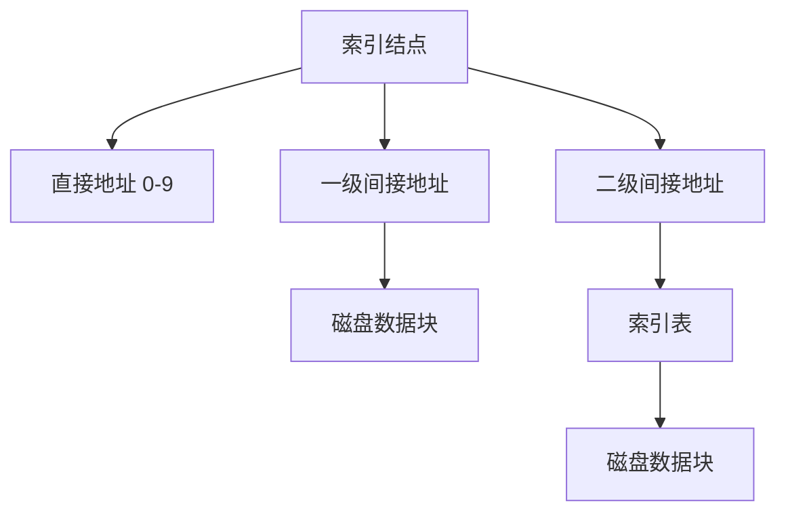

# 文件与设备管理 (File and Device Management)

## 1. 文件管理

### 1.1 文件索引 (Important)
软考常考 **多级索引** 的计算。

- **直接索引**：直接指向物理块。
- **一级间接索引**：指向一个包含物理块地址的索引表。
- **计算示例**：假设块大小为 4KB，地址占 4B，则一个索引表可容纳 1024 个地址。

### 1.2 树形目录结构
- **绝对路径**：从根目录 `/` 开始。
- **相对路径**：从当前目录开始。

---

## 2. 设备管理

### 2.1 I/O 控制方式
1. **程序查询方式**：CPU 一直等待，效率极低。
2. **中断驱动方式**：I/O 完成后发出中断，CPU 效率提高。
3. **DMA (直接存储器存取)**：数据在内存与设备间直接交换，不经过 CPU。
4. **通道方式**：专门的 I/O 处理机。

### 2.2 SPOOLing 技术 (假脱机)
利用磁盘作为缓冲，将独占设备模拟为共享设备。
- **组成**：输入井、输出井、输入进程、输出进程。

---

## 3. 微内核操作系统 (Microkernel)

- **核心思想**：将 OS 的核心功能（如进程调度、IPC）放在内核，其他功能（文件系统、驱动）放在用户空间。
- **优点**：可靠性高、扩展性强。
- **缺点**：性能开销（用户态/内核态频繁切换）。
