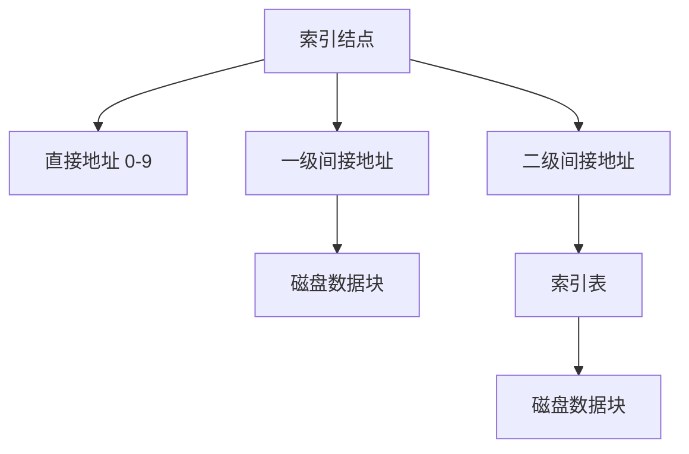

# 文件与设备管理 (File and Device Management)

## 1. 文件管理

### 1.1 文件索引 (Important)
软考常考 **多级索引** 的计算。

```mermaid
graph TD
    Root[索引结点]
    Root --> Direct1[直接地址 0-9]
    Root --> Indirect1[一级间接地址]
    Root --> Indirect2[二级间接地址]
    Indirect1 --> Page[磁盘数据块]
    Indirect2 --> Level1[索引表]
    Level1 --> Page2[磁盘数据块]
```

- **直接索引**：直接指向物理块。
- **一级间接索引**：指向一个包含物理块地址的索引表。
- **计算**：\(N = B/a\)（\(B\)=块大小，\(a\)=地址字节）；最大文件 = 直接 + 一级 + 二级… 全加。
- **计算示例**：块 4KB、地址 4B → \(N=1024\)；10 直接 + 1 一级 + 1 二级 ≈ 40KB + 4MB + 4GB。

> 深化：[多级索引手算与改参练习](../deep-dives/14-multi-level-index-tutorial.md)

### 1.2 树形目录结构
- **绝对路径**：从根目录 `/` 开始。
- **相对路径**：从当前目录开始。

### 1.3 位示图 (Bit Map) - 重点
用于管理磁盘空闲块。

- **原理**：用二进制的一位表示一个物理块的使用情况（0-空闲，1-占用）。
- **计算公式**：
    - 已知块号 $n$，求在位示图中的字号 $i$ 和位号 $j$：
        - $i = n / 字长$ (向下取整)
        - $j = n \% 字长$
    - **注意**：考试时需注意字号和位号是否从 0 开始。

---

## 2. 磁盘调度算法

假设磁头初始在 100 号磁道，请求序列为：55, 58, 39, 18, 90, 160, 150, 38, 184。

1. **FCFS (先来先服务)**：按序列顺序访问。
2. **SSTF (最短寻道时间优先)**：每次选离磁头最近的。**缺点**：可能产生“饥饿”现象。
3. **SCAN (电梯算法)**：磁头沿一个方向移动，直到该方向无请求，再反向。
4. **CSCAN (循环扫描)**：磁头只单向扫描，到达末尾后直接返回起点重新开始。

---

## 3. 设备管理
... (原有内容保持) ...

### 2.1 I/O 控制方式
1. **程序查询方式**：CPU 一直等待，效率极低。
2. **中断驱动方式**：I/O 完成后发出中断，CPU 效率提高。
3. **DMA (直接存储器存取)**：数据在内存与设备间直接交换，**不经过 CPU**（不是逐字节由 CPU 搬）。
4. **通道方式**：专门的 I/O 处理机。

### 2.2 SPOOLing 技术 (假脱机)
利用磁盘作为缓冲，将**独占设备**模拟为**共享设备**。
- **组成**：输入井、输出井、输入进程、输出进程。
- **与 DMA 区分**：DMA 管「怎么传」；SPOOLing 管「独占变共享」。对照见 [回顾 · 设备管理](./04-os-review.md#七设备与磁盘管理)。

---

## 3. 微内核操作系统 (Microkernel)

- **核心思想**：将 OS 的核心功能（如进程调度、IPC）放在内核，其他功能（文件系统、驱动）放在用户空间。
- **优点**：可靠性高、扩展性强。
- **缺点**：性能开销（用户态/内核态频繁切换）。
