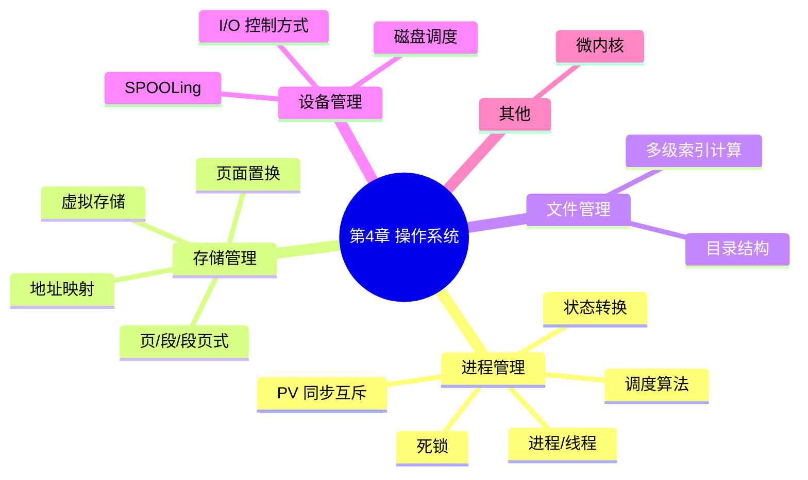

# 操作系统 — 第 4 章回顾巩固

> 教材第 4 章 · 上午题约 **6 分**（概念 + 手算）  
> 配套笔记：[进程管理](./01-process-management.md) · [存储管理](./02-memory-management.md) · [文件与设备](./03-file-and-device-management.md)  
> 来源：2026-07 第 4 章复习巩固

---

## 知识地图



---

## 一、进程与线程（送分 + 易混）

| 维度 | 进程 | 线程 |
|------|------|------|
| 资源分配单位 | ✅ 是 | ❌ 几乎不拥有 |
| 调度单位 | 传统上是 | 现代 OS 主要调度单位 |
| 系统开销 | 大（创建/撤销/切换） | 小 |
| 并发 | 进程间 | 线程间（同一进程内共享地址空间） |

**必背**：进程 = 程序的一次执行 + **资源分配**的基本单位；线程 = **调度**的基本单位。

### 进程五态转换（必考图题）

```text
新建 → 就绪 ⇄ 运行 → 终止
         ↑    ↓
         └── 阻塞（等待 I/O 等事件）
```

**陷阱**：

- 运行 → 就绪：时间片用完（**不是** I/O）
- 运行 → 阻塞：等待事件（**不是**时间片）
- 阻塞 → 就绪：事件发生；**不能直接** 阻塞 → 运行

---

## 二、进程调度算法（手算 + 概念）

### 「手算」算什么？

题目通常给出：作业名、**到达时间**、**服务时间（运行时间）**。需要算出：

1. **执行顺序**
2. **完成时间**
3. **周转时间** = 完成时间 − 到达时间
4. **等待时间** = 周转时间 − 服务时间
5. 常再求 **平均周转 / 平均等待**

不同算法只改「选下一个」的规则，后面公式相同。

### 算法对比表

| 算法 | 特点 | 考点 |
|------|------|------|
| **FCFS** 先来先服务 | 简单；短作业可能被长作业堵住 | 平均等待时间往往偏长 |
| **SJF** 短作业优先 | 平均等待时间最短 | 可能饥饿；需预知运行时间 |
| **RR** 时间片轮转 | 适合分时系统 | 时间片大小影响性能 |
| **优先级** | 高优先级先执行 | 低优先级可能饥饿 |
| **HRRN** 高响应比优先 | 响应比 = (等待+服务)/服务 | **兼顾** 短作业和等得久的作业 |

### FCFS：为什么说「短作业等待长作业」？

规则：谁先到谁先跑，**不看作业长短**。

例：A(0, 服务 8)、B(1, 4)、C(2, 1)

```text
0────────8────12───13
AAAAAAAAA BBBB C
```

| 作业 | 等待 | 说明 |
|------|------|------|
| A | 0 | 先到先跑 |
| B | 7 | 被长作业 A 挡住 |
| C | 10 | 只要跑 1，却等了 10 |

→ 先来的是长作业时，后面的短作业干等 → **平均等待时间偏长**。算法本身简单，表现完全取决于到达顺序。

### HRRN 公式（必背）

```text
响应比 R = (等待时间 W + 服务时间 S) / 服务时间 S
         = 1 + W/S
```

- `W`：已经等了多久（决策时刻 − 到达时间）
- `S`：还要跑多久（服务时间）
- 每次从就绪队列选下一个时，对**已到达且未完成**的作业算一遍 `R`，选 **最大**者。
- `S` 小 → `R` 易变大 → **偏向短作业**；`W` 变大 → `R` 也会涨 → **长作业不会永远饿死**。

**非抢占手算例**（同上 A/B/C）：A 先跑 0～8；在时刻 8：

- `R_B = (7+4)/4 = 2.75`
- `R_C = (6+1)/1 = 7` → 先跑 C，再跑 B（A→C→B）。C 的等待从 FCFS 的 10 降到 6。

### HRRN 五作业例（已掌握）

| 作业 | 到达 | 服务 S |
|------|------|--------|
| A | 0 | 7 |
| B | 2 | 4 |
| C | 4 | 1 |
| D | 5 | 4 |
| E | 6 | 2 |

**正确顺序：A → C → B → E → D**（非抢占；每次选当前就绪中 R 最大者）

| 时刻 | 就绪 | 响应比 | 选中 |
|------|------|--------|------|
| 0 | A | — | A，0～7 |
| 7 | B,C,D,E | `R_B=2.25`，`R_C=4`，`R_D=1.5`，`R_E=1.5` | **C**，7～8 |
| 8 | B,D,E | `R_B=2.5`，`R_D=1.75`，`R_E=2` | **B**，8～12（不可因 E 更短而改选） |
| 12 | D,E | `R_D=2.75`，`R_E=4` | **E**，12～14 |
| 14 | D | — | **D**，14～18 |

| 作业 | 开始 | 完成 | 周转 | 等待 |
|------|------|------|------|------|
| A | 0 | 7 | 7 | 0 |
| B | 8 | 12 | 10 | 6 |
| C | 7 | 8 | 4 | 3 |
| D | 14 | 18 | 13 | 9 |
| E | 12 | 14 | 8 | 6 |

平均周转 `(7+10+4+13+8)/5 = 8.4`；平均等待 `(0+6+3+9+6)/5 = 4.8`。

| 算法 | 选下一个的依据 | 短作业 | 长作业 |
|------|----------------|--------|--------|
| FCFS | 谁先到 | 可能被长作业堵死 | 先到就先跑 |
| SJF | 谁服务最短 | 最受照顾 | 可能饥饿 |
| HRRN | 谁响应比最大 | 通常优先 | 等久了能轮到 |

练习可配合：[PV 信号量模拟](../../exercises/03-pv-semaphore.ts)（同步另见第三节）。

---

## 三、PV 操作（本章最高频）

| 操作 | 含义 | 效果 |
|------|------|------|
| **P (wait)** | 申请资源 | `S = S - 1`；若 `S < 0` → 阻塞 |
| **V (signal)** | 释放资源 | `S = S + 1`；若 `S ≤ 0` → 唤醒一个等待进程 |

**初值含义**：`S = n` 有 n 个资源；`S = 0` 同步；`S = 1` 互斥（mutex）。

### 生产者-消费者（必背模板）

```text
empty = n   // 空缓冲区数
full  = 0   // 满缓冲区数
mutex = 1   // 互斥

生产者：P(empty) → P(mutex) → 生产 → V(mutex) → V(full)
消费者：P(full)  → P(mutex) → 消费 → V(mutex) → V(empty)
```

**铁律**：`P(mutex)` 与 `P(empty/full)` **顺序不能反**（先 P(mutex) 可能死锁）。

读者-写者：多个读者可同时读；写者互斥。考试常给操作序列判断能否互斥/是否死锁。

---

## 四、死锁

### 四个必要条件（缺一不可）

1. **互斥**
2. **请求与保持**
3. **不可剥夺**
4. **循环等待**

### 处理策略

| 策略 | 做法 |
|------|------|
| 预防 | 破坏四条件之一 |
| 避免 | **银行家算法**（分配前模拟是否安全） |
| 检测 | 允许发生，定期检测并恢复 |
| 忽略 | 鸵鸟策略 |

**银行家算法考点**：判断分配后是否**安全**、找**安全序列**；不安全则拒绝分配。

---

## 五、存储管理（计算题高发）

### 地址映射

逻辑地址（程序视角）→ **重定位** → 物理地址（内存实际地址）。

### 页 / 段 / 段页对比

| | 页式 | 段式 | 段页式 |
|---|------|------|--------|
| 划分 | 固定大小页 | 逻辑段（大小不等） | 先段后页 |
| 碎片 | 内部碎片 | 外部碎片 | 两者都有但较小 |
| 优点 | 利用率高 | 利于共享/保护 | 综合 |
| 地址 | 页号 + 页内偏移 | 段号 + 段内偏移 | 段表 → 页表 → 物理 |

### 虚拟存储与页面置换

基于 **局部性原理**（时间 + 空间）。

| 算法 | 特点 | 考点 |
|------|------|------|
| **OPT** | 淘汰最久以后才用的 | 理论最优，无法实现 |
| **FIFO** | 淘汰最早进入的 | 可能 **Belady 异常** |
| **LRU** | 淘汰最久未使用的 | 接近 OPT，常用 |

**Belady 异常**：页框增多，缺页率反而上升 — **仅 FIFO**。

**手算**：访问序列 + 页框数 → 按算法填表 → 缺页次数 / 缺页率。

相关练习骨架：[存储器计算](../../exercises/02-memory-calc.ts)（地址容量类；页置换需另手算）。

---

## 六、文件管理（多级索引计算）

块大小 \(B\)，地址项占 \(a\) 字节 → 每块地址项数 = \(B / a\)。

```text
直接容量 = 直接块数 × B
一级间接 = (B/a) × B
二级间接 = (B/a)² × B
最大文件 = 直接 + 各级间接之和
```

例：块 4KB，地址 4B → 每索引块 1024 项；10 直接 + 1 一级 + 1 二级 ≈ 40KB + 4MB + 4GB。

**陷阱**：问最大文件要把**所有**直接与各级间接加总。

目录：绝对路径从 `/`；相对路径从当前目录。

---

## 七、设备与磁盘管理

### I/O 控制方式（效率从低到高）

程序查询 → 中断驱动 → **DMA**（数据直传内存）→ 通道（专用 I/O 处理机）。

### 磁盘

```text
存取时间 = 寻道 + 旋转延迟 + 传输
```

| 调度 | 特点 |
|------|------|
| FCFS | 公平，寻道可能很多 |
| SSTF | 最短寻道；可能饥饿 |
| SCAN | 电梯：扫到边界再反向 |
| LOOK | 扫到**最后一个请求**就反向 |

**手算**：磁头当前位置 + 请求序列 → 按算法排序 → 总寻道距离。

### SPOOLing

用磁盘作缓冲，把**独占设备**模拟成**共享设备**（输入井/输出井 + 输入/输出进程）。

---

## 八、微内核（概念选择）

| | 宏内核 | 微内核 |
|---|--------|--------|
| 核心 | 功能大多在内核 | 只留调度、IPC 等 |
| 文件/驱动 | 内核态 | 用户态 |
| 优点 | 性能好 | 可靠性、扩展性强 |
| 缺点 | 模块故障影响大 | 态切换多，性能开销 |

---

## 九、高频考点速查

| 考点 | 题型 | 重要度 |
|------|------|--------|
| PV 手算 | 初值+操作序列 → 阻塞/唤醒 | ⭐⭐⭐⭐⭐ |
| 页面置换 | FIFO/LRU 缺页次数 | ⭐⭐⭐⭐⭐ |
| 多级索引 | 最大文件长度 | ⭐⭐⭐⭐ |
| 磁盘调度 | SCAN/LOOK 寻道距离 | ⭐⭐⭐⭐ |
| 死锁 + 银行家 | 四条件 / 安全序列 | ⭐⭐⭐⭐ |
| 进程状态转换 | 合法转换判断 | ⭐⭐⭐ |
| 页/段对比 | 碎片类型 | ⭐⭐⭐ |
| I/O / SPOOLing | 概念选择 | ⭐⭐⭐ |
| 调度算法 | FCFS/SJF/RR/HRRN 手算与对比 | ⭐⭐⭐⭐ |

---

## 十、自测题

**1.** 信号量 `S=2`，依次 P、P、P、V、P、V、V。第 3 次 P 后、第 5 次 P 后各有多少进程阻塞？

**2.** 访问序列 `1,2,3,4,1,2,5,1,2,3,4,5`，页框 3：FIFO 与 LRU 各缺页几次？（建议手算）

**3.** 块大小 1KB，地址项 2B，10 直接 + 1 一级 + 1 二级。最大文件约多大？

**4.** 磁头在 50，请求 `98,183,37,122,14,124,65,67`，SCAN 向磁道号增大，总寻道距离？

**5.** 作业 A(0,8)、B(1,4)、C(2,1)，非抢占 HRRN：执行顺序与 C 的等待时间？

**6.** 运行态因等待 I/O 进入什么态？I/O 完成后进入什么态？

<details>
<summary>点击查看答案</summary>

1. 第 3 次 P 后 **1** 个阻塞（S=-1）；V 后唤醒；第 5 次 P 后仍 **1** 个阻塞。
2. FIFO 约 **9**；LRU 约 **10**（务必自己填表核对）。
3. 每块 512 地址；直接 10KB + 一级 512KB + 二级 256MB → **约 256MB + 522KB**。
4. 顺序 50→65→67→98→122→124→183→37→14；距离 **302**。
5. 顺序 **A → C → B**；C 等待 = 8−2 = **6**。
6. 运行 → **阻塞**；事件完成 → **就绪**（不能直接运行）。

</details>

---

## 十一、考试速记

- **进程 vs 线程**：资源分配 vs 调度
- **状态**：阻塞只能到就绪，不能到运行
- **FCFS**：短作业可能等长作业；**HRRN**：`R = 1 + W/S`，兼顾短作业与等待
- **PV**：先资源信号量再 mutex；`S<0` 阻塞，`V` 后 `S≤0` 唤醒
- **死锁**：四条件；银行家找安全序列
- **页式内部碎片 / 段式外部碎片**；FIFO 才有 Belady
- **索引容量**：直接 + 一级 + 二级… 全加
- **磁盘**：寻道+旋转+传输；SCAN 到边界，LOOK 到末请求
- **DMA**：数据不经 CPU；SPOOLing：独占→共享
