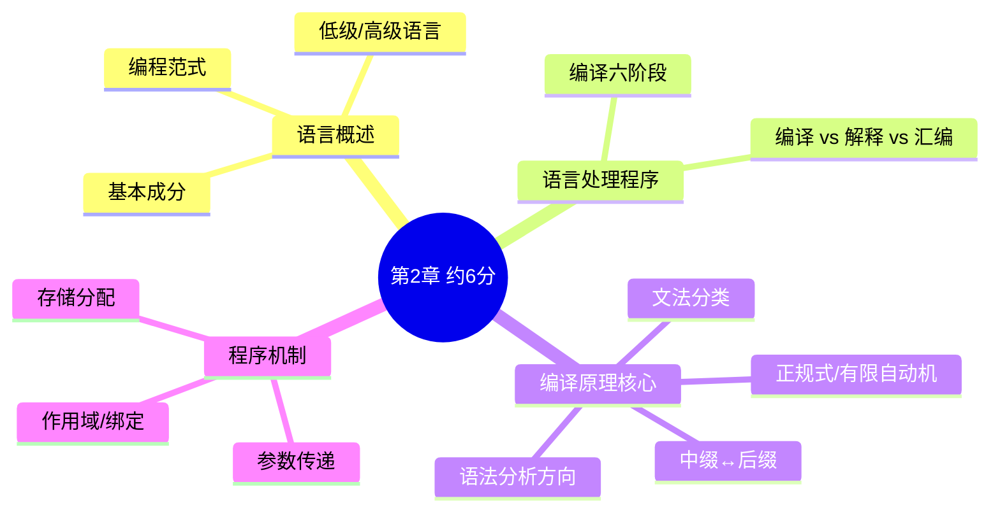

# 程序设计语言基础知识

> 教材第 2 章 · 上午题约 **6 分**（常见题号 20–22、50–52）  
> 侧重概念辨析与简单手算，记准即可拿分。

## 知识地图



---

## 1. 程序设计语言分类

| 类型 | 代表 | 考试关键词 |
| :--- | :--- | :--- |
| **机器语言** | 0/1 指令 | 硬件直接执行 |
| **汇编语言** | MOV、ADD | 与机器一一对应，需**汇编程序**翻译 |
| **高级语言** | C、Java、Python | 抽象层次高，需**编译/解释** |

### 编程范式

| 范式 | 核心思想 | 代表语言 |
| :--- | :--- | :--- |
| **过程式** | 过程/函数 + 顺序执行 | C、Pascal、Fortran |
| **面向对象** | 封装、继承、多态 | Java、C++、Smalltalk |
| **函数式** | 纯函数、不可变、无副作用 | Lisp、Haskell、F# |
| **逻辑式** | 事实 + 规则 + 推理 | Prolog |

> **🔥 考点提醒 (Q1)**：选择题常考「某语言/特性属于哪种范式」，重点区分过程式 vs 面向对象 vs 函数式 vs 逻辑式。

---

## 2. 三种语言处理程序

| | 汇编程序 | 编译程序 | 解释程序 |
| :--- | :--- | :--- | :--- |
| **输入** | 汇编语言 | 高级语言源程序 | 高级语言源程序 |
| **输出** | 机器语言 | **独立**目标程序 | **不生成**独立目标程序 |
| **运行** | 源程序不参与 | 源程序、编译器都不参与运行 | **解释器 + 源程序**都参与 |
| **特点** | — | 一次翻译，执行快 | 逐句翻译，调试方便 |

> **🔥 考点提醒 (Q2)**：编译后运行的是**目标程序**；解释是边翻译边执行，每次运行都要重新翻译，**不生成**独立目标程序。

---

## 3. 编译程序六阶段

```text
源程序 → 词法分析 → 语法分析 → 语义分析 → [中间代码] → [优化] → 目标代码
         ↓           ↓           ↓
       单词流      语法树      类型检查
```

| 阶段 | 输入 | 输出 | 做什么 |
| :--- | :--- | :--- | :--- |
| **词法分析** | 字符流 | **单词流（Token）** | 识别标识符、关键字、常数 |
| **语法分析** | 单词流 | **语法树/分析树** | 检查结构是否合法 |
| **语义分析** | 语法树 | 带类型信息的树 | 类型检查、静态语义 |
| 中间代码 | — | 三地址码等 | **可选** |
| 代码优化 | — | — | **可选** |
| 目标代码 | — | 机器码/汇编 | **可选** |

> **🔥 考点提醒 (Q3)**：词法、语法、语义三阶段**必须**；中间代码、优化、目标代码**可选**（完整编译器通常都包含）。

### 源程序错误类型

| 错误类型 | 典型表现 | 发现阶段 |
| :--- | :--- | :--- |
| **词法错误** | 非法字符、关键字拼写错 | 词法分析 |
| **语法错误** | 少分号、括号不配对 | 语法分析 |
| **静态语义错误** | 类型不匹配、参数不匹配 | 语义分析（编译期） |
| **动态语义错误** | 除零、死循环 | 运行期（逻辑错误） |

> **🔥 考点提醒 (Q4)**：类型检查在**语义分析**阶段，不在语法分析阶段。

---

## 4. 文法与自动机

### 乔姆斯基文法四级

从弱到强记 **3 → 2 → 1 → 0**：

| 类型 | 名称 | 对应自动机 | 用途 |
| :--- | :--- | :--- | :--- |
| **3 型** | 正规文法 | **有限自动机**（DFA/NFA） | **词法分析** |
| **2 型** | 上下文无关文法 | **下推自动机** | **语法分析**（程序语言文法） |
| 1 型 | 上下文有关文法 | 线性有界自动机 | 自然语言部分 |
| 0 型 | 无限制文法 | 图灵机 | 计算理论 |

> **🔥 考点提醒 (Q5)**：程序设计语言文法属于 **2 型（上下文无关）**；词法分析用 **3 型（正规式/有限自动机）**。

### 等价关系

- 正规式 ≡ NFA ≡ DFA（可相互转换）
- 上下文无关文法 ≡ 下推自动机

### 语法分析方法

| | 自顶向下（LL） | 自底向上（LR） |
| :--- | :--- | :--- |
| **推导** | 最左推导 | 最右推导的逆 |
| **典型** | 递归下降、预测分析 | 移进-归约 |
| **记忆** | **自上而下** | **自下而上** |

---

## 5. 中缀 ↔ 后缀（逆波兰式）

> 手算步骤与完整例题见 [中缀 ↔ 后缀深度讲解](../deep-dives/03-infix-postfix-tutorial.md)

**中缀 → 后缀**：运算符栈 + 输出，优先级高的先出；左括号入栈，右括号弹到左括号。

| 中缀 | 后缀 |
| :--- | :--- |
| `a + b * c` | `a b c * +` |
| `(a + b) * c` | `a b + c *` |

**后缀求值**：从左到右，遇操作数入栈，遇运算符弹出计算再入栈。

例：`3 4 5 * +` → 3 + (4×5) = **23**

> **🔥 考点提醒 (Q6)**：中缀转后缀与后缀求值是本章必会手算题，建议考前各练 3～5 道。

---

## 6. 程序基本成分

**四大成分**：数据、运算、控制、**传输**（函数调用/参数传递）

**三种基本控制结构**（结构化程序定理）：顺序、选择、循环——任意程序都可由这三者构成。

### 参数传递

| | 传值 | 传址（引用） |
| :--- | :--- | :--- |
| **传递内容** | 实参的**值** | 实参的**地址** |
| **形参能否改实参** | 不能（单向） | 能（双向效果） |
| **实参限制** | 变量、常量、表达式均可 | 必须是**有地址**的变量，不能是常量/表达式 |

> **🔥 考点提醒 (Q7)**：传址调用时，实参不能是 `a+1` 这类表达式（无固定地址）。

### 作用域与绑定

| 概念 | 说明 |
| :--- | :--- |
| **静态作用域** | 编译时确定，看**定义位置**（多数语言） |
| **动态作用域** | 运行时确定，看**调用链** |
| **编译时绑定** | 静态类型、静态作用域 |
| **运行时绑定** | 动态作用域、虚函数多态 |

---

## 7. 存储分配

| 方式 | 分配时机 | 典型内容 |
| :--- | :--- | :--- |
| **静态** | 编译时 | 全局变量、静态变量 |
| **栈** | 调用时 | 局部变量、形参、返回地址 |
| **堆** | 运行时申请 | `new` / `malloc` 动态对象 |

---

## 8. 真题常见陷阱

| 题目问法 | 正确答案 |
| :--- | :--- |
| 语法分析输入是什么？ | **单词流**（字符流是词法分析输入） |
| 哪个阶段做类型检查？ | **语义分析** |
| 程序设计语言文法属于哪类？ | **上下文无关文法（2 型）** |
| 词法分析用什么？ | **正规式 / 有限自动机（3 型）** |
| 解释程序是否生成目标程序？ | **不生成** |
| 传址调用时实参可以是 `a+1` 吗？ | **不可以** |

---

## 9. 自测清单

- [ ] 编译、解释、汇编三者的区别
- [ ] 词法 → 语法 → 语义 各阶段的输入/输出
- [ ] 乔姆斯基 3 型、2 型分别对应什么自动机、用于哪一阶段
- [ ] 中缀转后缀 + 后缀求值
- [ ] 传值 vs 传址
- [ ] 四种编程范式各举一种代表语言
