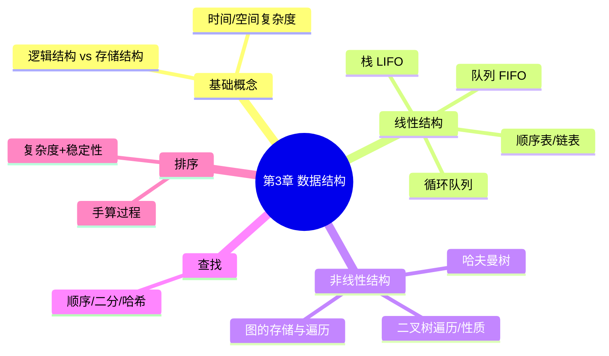

# 数据结构 — 第 3 章回顾巩固

> 教材第 3 章 · 上午题约 **8～12 分**；下午案例/算法题常考栈队列模拟、二叉树遍历、排序手算、查找比较次数  
> 来源：2026-07 第 3 章复习巩固

---

## 知识地图



---

## 一、基础概念（送分 + 易混）

### 1. 逻辑结构 vs 存储结构

| 维度 | 考什么 |
|------|--------|
| **逻辑结构** | 一对一（线性）、一对多（树）、多对多（图） |
| **存储结构** | 顺序、链式、索引、散列（哈希） |

**必背对比**：

| | 顺序存储 | 链式存储 |
|---|---------|---------|
| 随机访问 | O(1) ✅ | O(n) |
| 插入/删除 | O(n) 需移动 | O(1) 改指针 ✅ |
| 空间 | 可能浪费/需预分配 | 额外指针开销 |

### 2. 复杂度

- 只考**数量级**，手算时数「关键操作次数」
- 常见：O(1) < O(log n) < O(n) < O(n log n) < O(n²) < O(2ⁿ)

---

## 二、线性表 — 必考对比题

### 顺序表 vs 链表

- **第 i 个元素访问**：顺序 O(1)，链表 O(i)
- **在表头插入**：顺序 O(n)，链表 O(1)
- **考试陷阱**：「链表插入删除快」——指的是**已知位置**时；若要先找到位置，仍是 O(n)

### 单链表 / 双向链表 / 循环链表

| 类型 | 特点 | 常考点 |
|------|------|--------|
| 单链表 | 只能单向遍历 | 逆置、找环 |
| 双向链表 | 可双向，删除更方便 | 前后节点操作 |
| 循环链表 | 尾节点指向头 | 约瑟夫环 |

---

## 三、栈与队列 — 高频手算题

### 栈 Stack — LIFO

**典型应用**（选择题场景→栈）：

- 表达式求值（后缀式，见 [中缀 ↔ 后缀深度讲解](../deep-dives/03-infix-postfix-tutorial.md)）
- 括号匹配
- 递归调用
- 深度优先 DFS

**手算模板**：入栈 push、出栈 pop，画栈的变化过程。

### 队列 Queue — FIFO

**典型应用**：

- 广度优先 BFS
- 缓冲区、打印队列

### 循环队列 — 必背公式 🔥

> 深化：[循环队列空/满判断手算](../deep-dives/05-circular-queue-tutorial.md)

设数组长度 `m`，队头 `front`，队尾 `rear`（rear 指向**下一个空位**）：

```text
队列长度 = (rear - front + m) % m
队满条件 = (rear + 1) % m == front   ← 牺牲一个单元区分空/满
队空条件 = front == rear
```

**陷阱**：长度为 m 的数组，最多存 **m−1** 个元素。

---

## 四、树与二叉树 — 重中之重

### 1. 二叉树基本性质（必背）

- 第 i 层最多 **2^(i−1)** 个结点（i≥1）
- 深度 k 的二叉树最多 **2^k − 1** 个结点
- **叶子数 = 度为 2 的结点数 + 1**（n₀ = n₂ + 1）
- n 个结点的**完全二叉树**，深度 = ⌊log₂n⌋ + 1

### 2. 三种遍历（必会手算）

| 遍历 | 顺序 | 记忆 |
|------|------|------|
| 前序 | 根 → 左 → 右 | 根在前 |
| 中序 | 左 → 根 → 右 | 根在中 |
| 后序 | 左 → 右 → 根 | 根在后 |

**BST（二叉排序树）**：中序遍历 = **递增序列** ← 常考

### 3. 由遍历序列还原树 🔥

> 深化：[二叉树遍历还原手算](../deep-dives/06-tree-reconstruction-tutorial.md)

- **中序 + 前序** → 唯一确定
- **中序 + 后序** → 唯一确定
- **前序 + 后序** → **不能**唯一确定（缺中序）

**还原套路**：

1. 前序第一个 / 后序最后一个是根
2. 在中序里找根，左边是左子树，右边是右子树
3. 递归

### 4. 特殊二叉树

| 类型 | 考试要点 |
|------|---------|
| **满二叉树** | 每层都满，结点数 = 2^h − 1 |
| **完全二叉树** | 除最后一层外全满，最后一层从左连续 |
| **哈夫曼树** | 带权路径长度 WPL 最小；n 个叶子 → n−1 次合并（[深化讲解](../deep-dives/08-huffman-tree-tutorial.md)） |
| **平衡二叉树 AVL** | 任意结点左右子树高度差 ≤ 1；旋转类型（LL/RR/LR/RL） |

**哈夫曼编码**：左 0 右 1（或反过来，题目会说明）；**没有任何编码是另一个的前缀**（前缀码）。

---

## 五、图 — 存储 + 遍历

### 存储结构

| | 邻接矩阵 | 邻接表 |
|---|---------|--------|
| 空间 | O(V²) | O(V+E) |
| 判两顶点是否有边 | O(1) ✅ | O(degree) |
| 适合 | 稠密图 | 稀疏图 ✅ |

- 无向图邻接矩阵是**对称**的
- 无向图边数 = 矩阵非零元素 / 2

### 遍历

- **DFS** → 用**栈**（或递归）
- **BFS** → 用**队列**

### 最短路径（了解即可，选择常考概念）

- **Dijkstra**：单源，边权非负
- **Floyd**：多源，O(V³)

---

## 六、查找 — 手算比较次数

| 方法 | 条件 | 平均/成功 | 特点 |
|------|------|----------|------|
| 顺序查找 | 无 | O(n) | 有序无序都行 |
| 二分查找 | **有序** | O(log n) | 只能顺序存储 |
| 哈希查找 | 哈希表 | O(1) 理想 | 冲突处理 |

### 二分查找 🔥

- n 个元素，最多比较 **⌊log₂n⌋ + 1** 次
- **mid = (low + high) / 2**（注意整数除法）
- 失败时 low > high

### 哈希冲突处理

- **开放定址**：线性探测、二次探测
- **链地址法**（拉链法）：同一哈希值用链表 — 软考最常见

---

## 七、排序 — 必背大表 🔥🔥🔥

| 算法 | 平均时间 | 最坏 | 空间 | 稳定？ | 软考重点 |
|------|---------|------|------|--------|---------|
| 冒泡 | O(n²) | O(n²) | O(1) | ✅ | 一趟是否有序 |
| 选择 | O(n²) | O(n²) | O(1) | ❌ | 交换次数少 |
| 插入 | O(n²) | O(n²) | O(1) | ✅ | 基本有序时快 |
| 希尔 | — | — | O(1) | ❌ | 分组插入 |
| 快速 | O(n log n) | **O(n²)** | O(log n) | ❌ | 枢轴、分区（[第一趟手算](../deep-dives/07-quicksort-partition-tutorial.md)） |
| 归并 | O(n log n) | O(n log n) | **O(n)** | ✅ | 分治 |
| 堆排序 | O(n log n) | O(n log n) | O(1) | ❌ | 建堆、调整 |

**稳定排序**：冒泡、插入、归并、基数  
**不稳定**：选择、快速、堆、希尔

**快排最坏**：已有序 + 选第一个做枢轴 → O(n²)

**考试题型**：

1. 给一趟排序结果，问是哪种算法
2. 给序列，手算某一趟
3. 复杂度 / 稳定性选择

---

## 八、与第 2 章的衔接

[中缀 → 后缀 → 栈求值](../deep-dives/03-infix-postfix-tutorial.md) 就是「栈」最典型的应用。第 3 章栈 + 第 2 章表达式 = 下午/上午综合题常客。

---

## 九、自测题

**1.** 长度为 10 的循环队列数组（rear 指下一空位），front=3，rear=7，当前有几个元素？

**2.** 中序 `D B E A C`，后序 `D E B C A`，画二叉树（或写出前序）。

**3.** 有序表 `{2,5,8,12,16,23,38,56,72,91}` 中查找 23，需要比较几次？

**4.** 序列 `{49,38,65,97,76,13,27}` 做**第一趟**快速排序（以 49 为枢轴），结果是？

**5.** 以下哪些排序算法是**稳定**的？  
   A. 快速  B. 归并  C. 堆  D. 冒泡

**6.** 5 个权值 `{2,3,4,7,10}` 构造哈夫曼树，WPL（带权路径长度）是多少？

<details>
<summary>点击查看答案</summary>

1. **4** 个元素：`(7 - 3 + 10) % 10 = 4`
2. 前序：**A B D E C**（根 A；左子树中序 DBE → 前序 BDE；右子树 C）
3. **3** 次：与 38 → 与 16 → 与 23 命中（mid 序列依实现，常见为 38→16→23）
4. 第一趟快排（49 为枢轴）：**{27, 38, 13, 49, 76, 65, 97}**（小于 49 放左，大于放右，49 在中间）
5. **B、D**（归并、冒泡稳定）
6. WPL = **56**（合并：2+3→5, 4+5→9, 7+9→16, 10+16→26；逐叶子或合并和 5+9+16+26=56，见 [哈夫曼深化](../deep-dives/08-huffman-tree-tutorial.md)）

</details>

---

## 十、考试速记

- **顺序 vs 链式**：随机访问 vs 插入删除
- **循环队列**：长度 `(rear-front+m)%m`，最多 m−1 个元素
- **二叉树**：n₀ = n₂ + 1；中序+前序/后序可还原
- **查找**：二分要有序，最多 ⌊log₂n⌋+1 次
- **排序**：背复杂度+稳定性；快排最坏 O(n²)
