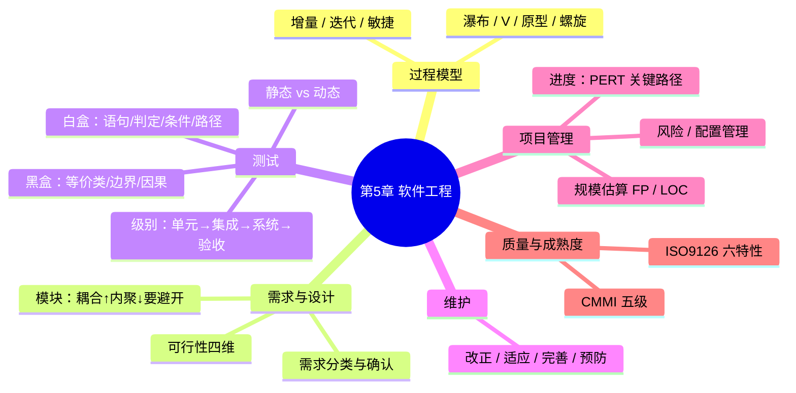

# 软件工程基础知识 — 第 5 章回顾巩固

> 教材第 5 章 · 上午约 **11 分**（软工大头）  
> 来源：2026-07-21 教材已读完后的重点考点深入讨论  
> 配套：[考试覆盖指南](../../syllabus/exam-coverage-guide.md) · [教材进度](../../syllabus/textbook-progress.md)  
> **续学入口**：文末「明天接着学」清单；深挖选题见 §8

---

## 知识地图



---

## 一、生命周期模型 —— 题干关键词对号

> **深挖**：[过程模型场景对比](../deep-dives/16-process-models-tutorial.md)（决策树 · 六题 · 易混辨析）

考试几乎不考「默写定义」，考的是：**给场景选模型**。

**10 秒口诀**：不清用原型，高风险螺旋，常变走敏捷，稳定才瀑布。

| 模型 | 一句话本质 | 题干信号词 | 易混点 |
|------|------------|------------|--------|
| **瀑布** | 文档驱动、阶段串行、难回退 | 需求**稳定**、规范文档、传统大型 | 不是「绝对不能返工」，而是**返工代价大** |
| **V 模型** | 开发与测试**左右对应** | 强调测试与阶段对应、验证确认 | 左侧需求↔右侧验收；设计↔集成/系统 |
| **原型** | 快速可见物，澄清需求 | 需求**不清**、用户界面、探索 | 抛弃型 / 演化型要分清 |
| **螺旋** | 瀑布 + 原型 + **风险驱动**，多圈迭代 | **风险高**、大型、反复评估 | 每圈：目标→风险→开发→评审 |
| **增量** | 分批交付可用子集 | 分版本上线、优先核心功能 | 增量是「产品切片」 |
| **迭代** | 反复 refinement 同一系统 | 架构逐步稳定、多轮改进 | 与增量常一起考对比 |
| **敏捷/XP** | 拥抱变化、短迭代、人 | 需求**常变**、小团队、客户现场 | XP：结对、TDD、持续集成、简单设计 |

### 易错辨析

- 「先做界面给用户看再定需求」→ **原型**，不是瀑布。
- 「每圈都评估风险再投入」→ **螺旋**，不是单纯增量。
- 「先交能用的 1.0，再加模块」→ **增量**；「同一块反复改到满意」→ 更偏 **迭代**。

### V 模型对应关系（常考）

```text
需求分析  ←→  验收测试
概要设计  ←→  系统测试
详细设计  ←→  集成测试
编码      ←→  单元测试
```

---

## 二、可行性、需求、设计

### 1. 可行性（四维，缺一就错）

技术 / 经济 / 社会（操作、法律、市场等）/ **进度（时间）**。

题干写「技术上能做但工期不够」→ 可行性不过关，卡的是**进度可行性**。

### 2. 需求

- **功能** vs **非功能**（性能、安全、可靠性、易用性）—— 描述「系统要快/安全」是非功能。
- **确认（validation）**：做对的事（用户要的）；**验证（verification）**：把事做对（符合规格）。口诀：**确认对用户，验证对文档**。
- 需求变更必须进**变更控制**（配置管理），不能口头改。

### 3. 模块化：耦合与内聚（和第 6 章交界，第 5 章也常考）

目标：**高内聚、低耦合**。

**耦合从低到高（越好 → 越差）**大致：

```text
非直接 → 数据 → 标记（结构体当参数）→ 控制（传开关决定行为）→ 外部/公共（全局）→ 内容（改对方内部）
```

**内聚从低到高（越差 → 越好）**大致：

```text
偶然 → 逻辑 → 时间内 → 过程 → 通信 → 顺序 → 功能
```

题干陷阱：

- 「模块 A 直接改 B 的内部数据」→ **内容耦合**（最差）。
- 「一个模块只干一件事」→ **功能内聚**（最好）。

---

## 三、测试 —— 性价比最高的一块

### 1. 测试级别（顺序固定）

```text
单元测试 → 集成测试 → 系统测试 → 验收测试（α/β）
```

| 级别 | 测什么 | 谁主导（常考） |
|------|--------|----------------|
| 单元 | 模块/函数 | 开发 |
| 集成 | 接口、组装 | 开发为主 |
| 系统 | 整系统 vs 需求 | 测试组 |
| 验收 | 用户环境是否接受 | **用户**/客户；α 在开发方，β 在用户方 |

**回归测试**：改完再测，防止引入新错 —— 维护和持续集成场景常绑在一起考。

### 2. 静态 vs 动态

- **静态**：不运行 —— 评审、走查、检查表、静态分析。
- **动态**：要跑程序 —— 黑盒/白盒。

### 3. 黑盒（功能）

| 方法 | 抓什么 | 典型题 |
|------|--------|--------|
| **等价类** | 有效/无效分区，每区代表值 | 输入范围分成几类 |
| **边界值** | 边界及稍内/稍外 | 「最容易出错在边界」 |
| **因果图/判定表** | 多条件组合 | 条件多、有约束 |
| **错误推测** | 经验猜错 | 补充手段 |

边界口诀：区间 \([a,b]\) 常测 \(a-1, a, a+1, b-1, b, b+1\)（再结合等价类裁剪）。

### 4. 白盒（结构）—— 覆盖强度

从弱到强（记住顺序，常考「哪个覆盖更强」）：

```text
语句覆盖 < 判定（分支）覆盖 < 条件覆盖 < 判定/条件覆盖 < 路径覆盖
```

注意陷阱：

- **条件覆盖**不一定包含**判定覆盖**（经典反例题）。
- **路径覆盖**最强但路径爆炸，实际难全做。
- McCabe **环复杂度** \(V(G)=e-n+2\)（或判定数+1）→ 独立路径条数下限，和白盒路径相关。

### 5. 集成策略

| 策略 | 需要 | 特点 |
|------|------|------|
| **自顶向下** | 桩（stub） | 早见控制结构 |
| **自底向上** | 驱动（driver） | 早测底层 |
| **三明治/混合** | 两边夹 | — |
| **一次性组装（大爆炸）** | — | 接口问题难定位（反面） |

---

## 四、维护类型 —— 四选一送分题

| 类型 | 原因 | 题干信号 |
|------|------|----------|
| **改正性** | 改 bug | 出错、缺陷、故障 |
| **适应性** | 环境变 | 换 OS/数据库/法规环境 |
| **完善性** | 功能增强 | 新需求、更好用、加功能（维护阶段占比通常最大） |
| **预防性** | 为将来 | 重构、提高可维护性、防患 |

陷阱：「用户要求增加报表」在维护期 → **完善性**，不是改正性。

可维护性相关：可理解、可修改、可测试 —— 与文档、低耦合相关。

---

## 五、项目管理 —— 会算比会死记重要

### 1. 规模与工作量

- **LOC**：代码行，简单但语言相关。
- **功能点 FP**：以用户功能为准，跨语言比较；常考「FP 更适合早期估算」。
- **COCOMO**：由规模估工作量/工期（了解有基本/中等/详细即可）。

### 2. 进度：PERT / 关键路径（必会手算）

- 活动用节点或箭线表示；算 **ES/EF/LS/LF**，松弛 \(TF = LS - ES\)。
- **关键路径**：总时差为 0 的路径；决定最短工期。
- 关键路径上活动延误 → **项目延误**；非关键可有浮动。

三点估计（若考）：

\[
T_e = \frac{乐观 + 4\times最可能 + 悲观}{6}
\]

### 3. 风险

风险 = \(f(概率, 影响)\)。

| 策略 | 题干信号 |
|------|----------|
| 回避 | 不做高风险活动 |
| 转移 | 买保险、外包 |
| 减轻 | 加测试、备选方案 |
| 接受 | 预留应急、知悉承受 |

### 4. 配置管理（常考概念）

- **基线（baseline）**：通过评审、受控的版本快照。
- 变更走 CCB；配置项包括代码、文档、数据等。
- 版本 vs 修订：对外发布常称版本，内部修正称修订（以教材表述为准）。

---

## 六、质量与成熟度

### 1. ISO/IEC 9126（或同类质量模型）六特性

功能 / 可靠 / 易用 / 效率 / 可维护 / 可移植。

题干「软件从 Windows 迁到 Linux 难」→ **可移植性**。

### 2. CMMI 五级

| 级 | 名 | 特征关键词 |
|----|-----|------------|
| 1 | 初始 | 英雄主义、不可预测 |
| 2 | 已管理 | 项目级、需求/计划/跟踪/配置 |
| 3 | 已定义 | **组织级**标准过程 |
| 4 | 量化管理 | 度量、统计过程控制 |
| 5 | 优化 | 持续改进、缺陷预防、技术创新 |

易错：2 与 3 —— 有项目纪律但未组织标准化 → **2**；全公司统一过程资产 → **3**。

---

## 七、C 档复习法（每周约 30min）

1. **场景题 10 道**：模型 / 维护类型 / 测试级别 / CMMI。
2. **手算 1 道**：关键路径（或环复杂度）。
3. **一张表**：耦合内聚顺序、白盒覆盖强度 —— 睡前过一遍。

不必重写长笔记；教材已读，缺口是**对号入座的反应速度**。

---

## 八、深挖选题（续学时选一块）

1. ~~**过程模型**场景对比~~ ✅ 2026-07-21 过关 → [16-process-models](../deep-dives/16-process-models-tutorial.md)
2. **测试**（黑盒边界 + 白盒覆盖强度反例）← **明天优先**
3. **耦合内聚**排序题专项
4. **PERT 关键路径**手算模板
5. **CMMI + 质量特性**速记与易混

---

## 九、明天接着学（2026-07-22）

- [ ] 开场：「继续第 5 章，深挖测试」
- [ ] 做测试 deep-dive（边界值手算 + 白盒覆盖强度/反例）
- [ ] 过程模型：只过口令卡 30 秒，不重开长讲
- [ ] （可选）维护四类型 + CMMI 默写；或收尾选择卷
- [ ] 换机前确认已 `git pull`；入口见 [交接看板](../deep-dives/01-learning-logs.md)

**过关后再标第 5 章「已学完」**（建议：测试深挖 + 收尾卷）。
