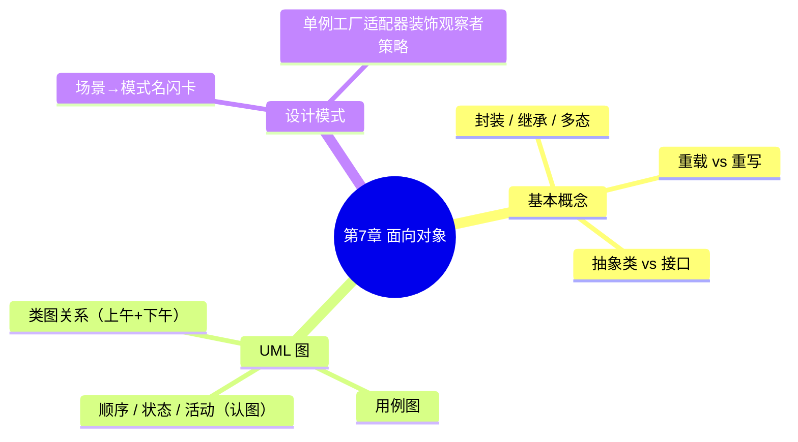

# 面向对象技术 — 第 7 章开场入口

> 教材第 7 章 · 上午约 **13 分** + 下午 UML 约 **15 分**（选做）  
> 状态：✅ 已学完 · 2026-08-06（官方 UML 印刷题后补）  
> 上章：第 6 章 ✅（官方 DFD 印刷图后补）  
> 下章：[第 8 章算法开场](../08-algorithms/01-algorithms-entry.md)  
> 配套：[教材进度](../../syllabus/textbook-progress.md) · [交接看板](../deep-dives/01-learning-logs.md)

---

## 开场白（续学用）

```text
开始第 7 章，先搞清面向对象基本概念 + 类图关系
```

---

## 知识地图（C 档优先级）



| 块 | 优先级 | 目标 |
|----|--------|------|
| **P0 概念** | 先开 | 封装继承多态；重载≠重写；抽象类/接口 |
| **P0 类图关系** | 核心 | 关联 / 聚合 / 组合 / 依赖 / 泛化 / 实现 —— 会认符号 |
| **P0 用例图** | 下午 | 参与者、用例、包含/扩展/泛化 |
| **P1 其他 UML** | 认图 | 顺序图、状态图、活动图 |
| **P1 设计模式** | 穿插 | 6～8 个高频：场景→选名 |
| **P2 真题** | 章中后段 | 下午类图/用例补全 1 道 |

---

## 建议学习顺序（约 1～1.5h/次）

1. **本次 / 下次**：面向对象基本概念口令 + 辨型 5 题  
2. **接着**：类图六种关系（符号 + 场景）  
3. **然后**：用例图关系  
4. **穿插**：设计模式闪卡（不必等概念全完）  
5. **提分**：下午 UML 真题读图 1 道  

官方 DFD 印刷题 → **穿插**，不挡本章。

---

## 与第 6 章的交界

| 第 6 章 | 第 7 章 |
|---------|---------|
| DFD / 模块 / 耦合内聚 | 类图 / 对象 / 消息 |
| 结构化「加工」 | OO「职责落在类上」 |
| 官方 DFD 真题后补 | 不挡开本章 |

---

## 第一次课最小目标

- [x] 能口述：封装、继承、多态各一句 ✅ 2026-08-05 · [24](../deep-dives/24-oo-concepts-tutorial.md)
- [x] 能区分：重载 vs 重写
- [x] 能区分：抽象类 vs 接口（软考口径）

**下一刀**：用例图（参与者、包含/扩展/泛化）

已过关：
- [x] OO 概念 → [24](../deep-dives/24-oo-concepts-tutorial.md)
- [x] 类图六种关系 → [25](../deep-dives/25-class-diagram-relations-tutorial.md)
- [x] 用例图 → [26](../deep-dives/26-usecase-diagram-tutorial.md)
- [x] 设计模式六高频 → [27](../deep-dives/27-design-patterns-tutorial.md)
- [x] 序列图/状态图认图 → [28](../deep-dives/28-sequence-state-diagram-tutorial.md)

**下一刀**：下午 UML 真题读图（提分）· 或 · 标第 7 章学完后开第 8/9/10 章

续学开场白：
```text
第 7 章标学完
```
或
```text
开始下午 UML 真题读图
```

---

## 笔记将落盘

```text
notes/07-oop/           ← 本章回顾（本文为开场）
notes/deep-dives/       ← 类图 / 用例 / 模式 deep-dive（过关再开）
practice/drills/        ← 日后 UML 小卷
```
