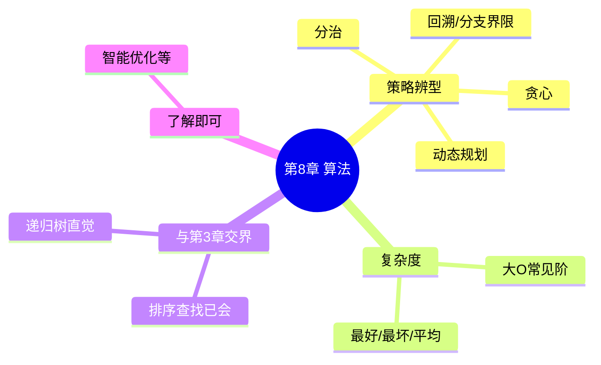

# 第 8 章 · 算法设计与分析 — 开场入口

> 教材第 8 章 · 上午约 **1 分**（很轻）· 与下午算法题弱相关  
> 状态：🔄 进行中 · 开场日 2026-08-06（第 7 章已标学完）  
> 上章：[第 7 章开场](../07-oop/01-oop-uml-review.md)（官方 UML 印刷题后补）  
> 配套：[教材进度](../../syllabus/textbook-progress.md) · [交接看板](../deep-dives/01-learning-logs.md)

---

## 开场白（续学用）

```text
开始第 8 章，先分清算法策略：分治 / 贪心 / 动态规划 / 回溯
```

---

## 考什么（先定预期）

| 场次 | 本章角色 |
|------|----------|
| **上午** | 偶 1 题：给场景选策略名，或复杂度数量级 |
| **下午算法** | 主要靠 **第 3 章**手算 + **真题填空/C 代码**；本章给「用什么思路」的标签 |

C 档原则：**略读策略辨型 + 复杂度表**，不深挖证明；下午编程另开专项。

---

## 知识地图（C 档）



| 块 | 优先级 | 目标 |
|----|--------|------|
| **P0 策略辨型** | 先开 | 分治/贪心/DP/回溯：场景→名字 |
| **P0 复杂度** | 常考 | O(1)/O(log n)/O(n)/O(n log n)/O(n²) 认阶 |
| **P1 经典例** | 略 | 钢条切割、背包（0-1）、最短路径标签 |
| **P2 下午编程** | 后置 | 真题填空；链到补充模块「算法编程」 |

---

## 建议学习顺序（约 1～2 次课）

1. **本次**：四种策略人话 + 辨型 5～6 题  
2. **接着**：常见复杂度表 + 与排序复杂度对照（第 3 章已有）  
3. **可选**：0-1 背包 / 最长公共子序列 各看 1 个口述思路  
4. **不挡**：智能优化、详细递推证明  

---

## 与第 3、7 章交界

| 已有 | 本章补什么 |
|------|------------|
| 快排/归并/堆排过程 | 归到「分治」标签 |
| 哈夫曼 | 可归「贪心」直觉 |
| 设计模式·策略 | 名字像，但考的是**算法设计策略**不是 GoF |

---

## 第一次课最小目标

- [x] 分治 / 贪心 / 动态规划 / 回溯 各一句 ✅ 2026-08-08 · [29](../deep-dives/29-algorithm-strategies-tutorial.md)
- [x] 给场景能选对策略名（5 题）
- [x] 常见大 O 阶能排序

**说明**：第 8 章上午约 1 分是「策略/复杂度」份额；排序树等细节在第 3 章；下午编程另算。

续学（计划 C）：主线切 **第 10 网络** 或 **第 9 数据库**；开场白见看板。
