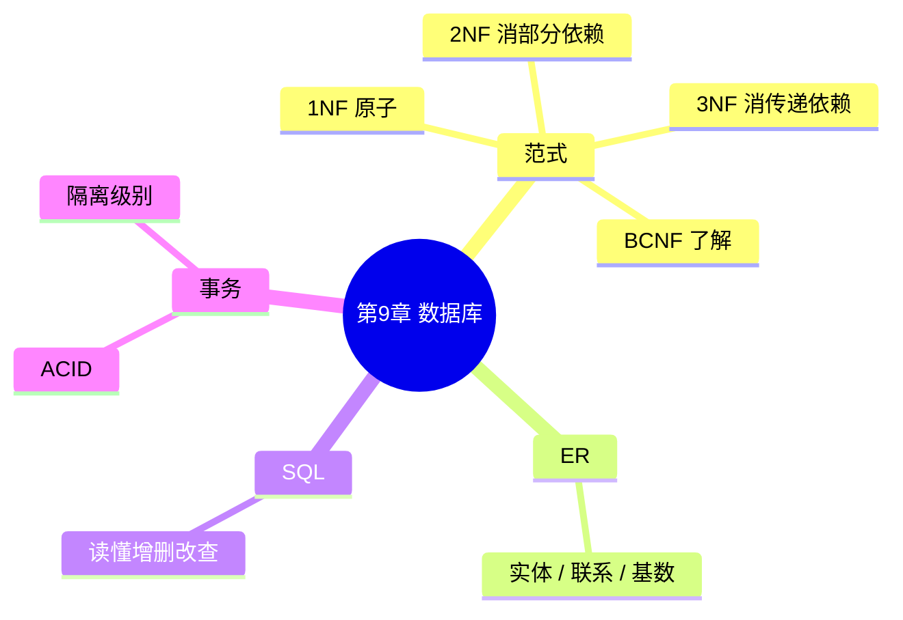

# 第 9 章 · 数据库技术基础 — 开场入口

> 教材第 9 章 · 上午约 **6 分** + 下午数据库设计约 **15 分**（选做）  
> 状态：🔄 进行中 · 开场日 2026-08-17（第 8 章已标学完）  
> 上章：[第 8 章算法开场](../08-algorithms/01-algorithms-entry.md)  
> 配套：[教材进度](../../syllabus/textbook-progress.md) · [交接看板](../deep-dives/01-learning-logs.md)

---

## 开场白（续学用）

```text
开始第 9 章，数据库范式
```

---

## 考什么（先定预期）

| 场次 | 本章角色 |
|------|----------|
| **上午** | 范式辨型 / 候选键 / 异常类型；SQL 读懂；ACID / 隔离级别 |
| **下午** | ER → 关系模式（选做约 15 分）；官方印刷图后补 |

C 档原则：**先范式能对**，再 ER / SQL / 事务；下午真题不挡概念过关。

---

## 知识地图（C 档）



| 块 | 优先级 | 目标 |
|----|--------|------|
| **P0 范式** | 先开 | 1NF/2NF/3NF 辨型 + 一张表分解到 3NF |
| **P0 函数依赖** | 同课 | 候选键、主属性、部分 vs 传递 |
| **P1 ER** | 接着 | 实体、联系、1:1 / 1:n / n:m |
| **P1 SQL** | 接着 | 读懂 SELECT / JOIN / GROUP BY |
| **P1 事务** | 接着 | ACID + 脏读/不可重复读/幻读 |
| **P2 下午 ER** | 后置 | 官方印刷题；链到补充模块「数据库设计」 |

---

## 建议学习顺序（约 1～1.5h/次）

1. **本次**：函数依赖口令 + 1NF/2NF/3NF 辨型 + 1 道分解  
2. **接着**：ER 基数 + 转关系模式规则  
3. **然后**：SQL 读题；事务对照表  
4. **不挡**：BCNF 细证、SQL 手写复杂嵌套、官方下午卷  

---

## 与第 6、7 章交界

| 已有 | 本章补什么 |
|------|------------|
| 数据字典（流里有什么） | 关系模式（表怎么拆、键是谁） |
| 类图（类与关系） | ER（实体与联系）；下午常一起出现但不是同一套符号 |

---

## 第一次课最小目标

- [x] 能口述：1NF / 2NF / 3NF 各一句 ✅ 2026-08-17 · [30](../deep-dives/30-normalization-tutorial.md)
- [x] 能区分：部分依赖 vs 传递依赖
- [x] 能指出：单属性主键 ⇒ 已是 2NF（经典陷阱）
- [x] 一张表能分解到 3NF

**下一刀**：ER（实体、联系、1:1 / 1:n / n:m）· 或 · 隔日子网 1 题

续学开场白：
```text
开始第 9 章，ER 模型
```

---

## 笔记将落盘

```text
notes/09-database/      ← 本章开场（本文）
notes/deep-dives/       ← 范式 deep-dive（过关再标）
practice/drills/        ← 日后库设计小卷
```
