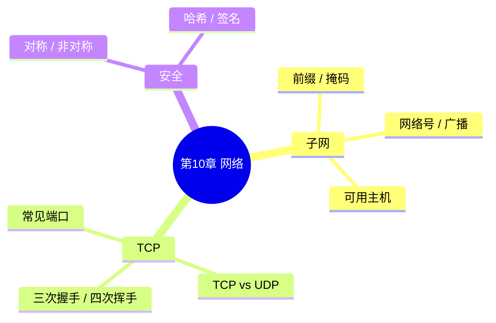

# 第 10 章 · 网络与信息安全 — 开场入口

> 教材第 10 章 · 上午约 **6 分** · 几乎没有下午  
> 状态：🔄 进行中 · 开场日 2026-08-18（第 9 章已标学完）  
> 上章：[第 9 章开场](../09-database/01-database-entry.md)（官方下午 ER 后补）  
> 配套：[教材进度](../../syllabus/textbook-progress.md) · [交接看板](../deep-dives/01-learning-logs.md)

---

## 开场白（续学用）

```text
开始第 10 章，子网划分
```

---

## 考什么（先定预期）

| 场次 | 本章角色 |
|------|----------|
| **上午** | 子网手算；TCP/UDP / 握手；端口；对称/非对称/签名 |
| **下午** | 基本不考 |

C 档原则：**子网能手算** 是本章 P0；TCP 对照表次之；加密认场景；不深挖协议栈实现。

---

## 知识地图（C 档）



| 块 | 优先级 | 目标 |
|----|--------|------|
| **P0 子网** | 先开 | 给 IP+/n → 网络号、广播、可用数；能否同网 |
| **P1 TCP/UDP** | 接着 | 握手/挥手顺序；面向连接 vs 数据报 |
| **P1 端口** | 穿插 | 80/443/22/25/53/3306 等常考表 |
| **P1 加密** | 接着 | 对称快、非对称交换密钥、私钥签名公钥验 |
| **P2** | 不挡 | OSI 七层细背、复杂 ACL |

---

## 建议学习顺序（约 1～1.5h/次）

1. **本次**：子网块大小法 + 手算 5 题  
2. **接着**：TCP 握手 / 挥手 + UDP 对比  
3. **然后**：加密场景辨型  
4. **不挡**：路由协议细节、IPv6 深挖  

---

## 第一次课最小目标

- [ ] 能由 /n 写出掩码和块大小
- [ ] 能算：网络号、广播、可用主机数
- [ ] 能判：两个 IP 是否同网

续学开场白：
```text
继续第 10 章，子网手算
```
或过关后：
```text
开始第 10 章，TCP 握手
```

---

## 笔记将落盘

```text
notes/10-network/       ← 本章开场（本文）
notes/deep-dives/       ← 子网 [34] 进行中
```
