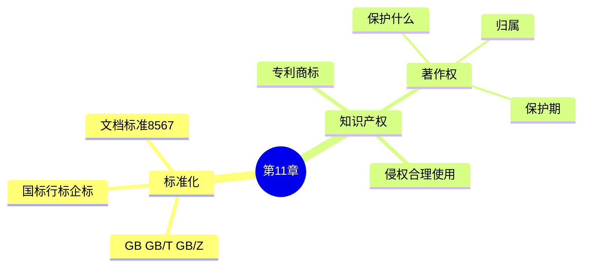

# 第 11 章 · 标准化与软件知识产权 — 开场入口

> 教材第 11 章 · 上午约 **4 分** · 几乎没有下午  
> 状态：🔄 轻量初读 · 2026-08-20  
> 上章：[第 10 章网络](../10-network/01-network-entry.md)  
> 配套：[教材进度](../../syllabus/textbook-progress.md) · [39 速查](./../deep-dives/39-standard-ip-tutorial.md)

---

## 开场白（续学用）

```text
开始第 11 章知识产权
```

---

## 考什么（C 档预期）

| 场次 | 本章角色 |
|------|----------|
| **上午** | 标准代号辨型；著作权归属/保护期；专利 vs 著作权；侵权场景 |
| **下午** | 基本不考 |

C 档原则：**2 页速查表 + 场景选择题**；10 月或考前 2～3 周再集中背一轮。

---

## 知识地图



| 块 | 优先级 | 目标 |
|----|--------|------|
| **P0 著作权** | 先记 | 保护表达不保护思想；职务/委托归属；保护期 |
| **P1 标准代号** | 接着 | GB vs GB/T vs GB/Z；ISO/IEC |
| **P1 专利等** | 了解 | 专利要申请；算法本身一般不单独专利 |
| **P2** | 不挡 | 标准化组织历史、条文细节 |

---

## 第一次课最小目标（轻量初读）

- [ ] 能辨：GB / GB/T / GB/Z
- [ ] 能答：软件著作权保护什么、不保护什么
- [ ] 能辨：职务开发、委托开发归属
- [ ] 能认：自然人 vs 法人保护期（大意）

续学：
```text
继续第 11 章，知识产权速查
```
考前强化：
```text
第 11 章背表过关
```

---

## 笔记落盘

```text
notes/11-standard-ip/   ← 本章开场（本文）
notes/deep-dives/       ← [39] 速查进行中
```
