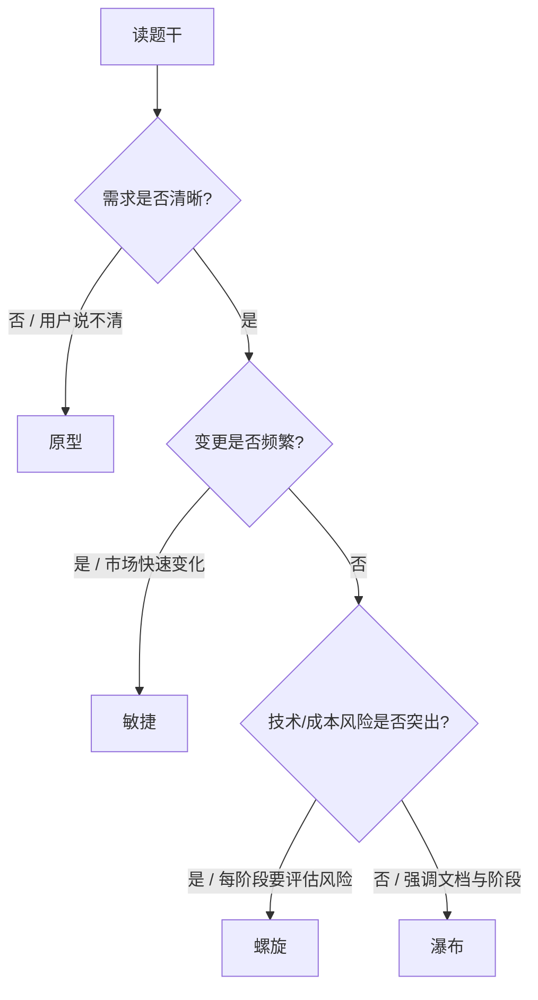

# 过程模型场景对比详解（瀑布 / 原型 / 螺旋 / 敏捷）

> 第 5 章软工 · 上午「给场景选模型」必考  
> 配套回顾：[01-software-engineering-review](../05-software-engineering/01-software-engineering-review.md)  
> 来源：2026-07-21 深挖 §8-1

---

## 1. 先抓一根主轴：题干在问什么？

四模型不是「好不好」，而是 **适用条件不同**。审题只抓一个主矛盾：

```text
需求清不清？     → 不清 → 原型（先摸清楚）
会不会大变？     → 常变 → 敏捷（拥抱变化）
风险高不高？     → 很高 → 螺旋（每圈先控风险）
都稳定、要规范？ → 稳定 → 瀑布（文档串行）
```

**决策口诀（考试 10 秒）**：

> **不清用原型，高风险螺旋，常变走敏捷，稳定才瀑布。**



> 若题干同时出现多个信号，以 **最强调的那个词** 为准（见 §4 易混）。

---

## 2. 四个模型各自「长什么样」

### 2.1 瀑布模型（Waterfall）

```text
可行性 → 需求 → 设计 → 编码 → 测试 → 维护
         （阶段串行，文档驱动，难回头）
```

| 维度 | 要点 |
|------|------|
| 本质 | 上一阶段文档通过后才进下一阶段 |
| 优点 | 结构清晰、文档全、便于管理与验收 |
| 缺点 | 需求错了发现晚；变更代价大 |
| 信号词 | 需求**稳定/明确**、大型传统、强调文档、阶段评审 |
| 不是 | 「绝对不能返工」——而是返工**很贵** |

### 2.2 原型模型（Prototype）

```text
快速做一个「看得见」的东西 → 用户反馈 → 澄清需求 → 再正式开发
```

| 维度 | 要点 |
|------|------|
| 本质 | 用可运行/可演示物 **降低需求不确定性** |
| 类型 | **抛弃型**（用完扔掉，只为搞清需求）/ **演化型**（原型演进成产品） |
| 信号词 | 需求**不清**、用户界面、先做 demo、交互体验、探索式 |
| 易混 | 有迭代感，但驱动因是「搞不清要什么」，不是「控风险」 |

### 2.3 螺旋模型（Spiral）

```text
每一圈大致：确定目标 → 风险分析 → 开发/验证 → 计划下一圈
（瀑布 + 原型思想 + 风险驱动，多圈）
```

| 维度 | 要点 |
|------|------|
| 本质 | **风险驱动**的迭代；风险大就多分析、少盲目编码 |
| 优点 | 适合大型、复杂、高风险项目 |
| 缺点 | 风险分析本身成本高；对人员要求高 |
| 信号词 | **风险**、风险评估、反复评估、大型复杂、原型+瀑布结合 |
| 口诀 | 每圈都问：值不值得继续投？ |

### 2.4 敏捷（Agile，常考 XP / Scrum 特征）

```text
短迭代交付可工作软件 ↔ 客户持续反馈 ↔ 拥抱需求变化
```

| 维度 | 要点 |
|------|------|
| 本质 | 人与协作 > 过程文档；工作软件 > 完备文档；响应变化 > 遵循计划 |
| XP 常考点 | 结对编程、测试驱动(TDD)、持续集成、简单设计、现场客户、小版本 |
| Scrum 常考点 | Sprint、产品负责人、每日站会、可工作增量 |
| 信号词 | 需求**经常变化**、小团队、快速交付、客户参与、迭代短 |
| 不是 | 「完全不要文档」——是文档**够用即可** |

---

## 3. 对照总表（背这一张）

| | 瀑布 | 原型 | 螺旋 | 敏捷 |
|--|------|------|------|------|
| **驱动** | 文档/阶段 | 需求澄清 | **风险** | 变化/交付价值 |
| **需求** | 开始就应明确 | 开始不清 | 可逐步明确 | 允许持续变 |
| **迭代?** | 基本不 | 有（围绕原型） | 有（多圈） | 有（短冲刺） |
| **典型规模** | 中大型、规范项目 | 交互重、需求模糊 | 大型高风险 | 中小、变化快 |
| **文档** | 重 | 可轻（早期） | 中（含风险文档） | 轻量 |
| **关键词** | 稳定、规范 | 不清、界面 | 风险、评估 | 常变、客户、短迭代 |

---

## 4. 易混辨析（送分陷阱）

### 4.1 原型 vs 螺旋

| | 原型 | 螺旋 |
|--|------|------|
| 核心目的 | 搞清**用户要什么** | 控制**做不成/超预算**等风险 |
| 题干 | 「用户说不清」「先做界面看」 | 「风险高」「每阶段评估风险」 |
| 记忆 | 用户视角 | 项目/成本/技术不确定性视角 |

同一项目可以「用原型做某一圈的风险缓解」——若选项只能选一个，看题干**主标签**是「需求」还是「风险」。

### 4.2 螺旋 vs 敏捷

| | 螺旋 | 敏捷 |
|--|------|------|
| 共同点 | 都迭代 | 都迭代 |
| 差异 | 强调**风险分析圈**；偏大型、管理重 | 强调**拥抱变化、快速交付、人**；过程轻 |
| 题干 | 风险评估、Boehm、风险驱动 | 用户故事、Sprint、结对、持续集成 |

### 4.3 瀑布 vs 敏捷

| | 瀑布 | 敏捷 |
|--|------|------|
| 变更 | 尽量避免后期变更 | 欢迎变更 |
| 交付 | 末期一次大交付 | 频繁可工作增量 |
| 文档 | 驱动过程 | 服务沟通 |

### 4.4 顺带：增量 / 迭代（常夹在选项里）

- **增量**：按功能切片，先交付能用的子集（1.0 → 加模块 → 2.0）。  
- **迭代**：同一系统反复 refinement（架构/质量逐步到位）。  
- 与四模型关系：敏捷常「增量 + 迭代」；螺旋是风险驱动的迭代；瀑布一般不做增量交付。

### 4.5 V 模型

瀑布的变体，强调 **开发阶段 ↔ 测试级别** 左右对应。  
题干若写「测试与开发阶段对应」「验证确认贯穿」→ V；不要误选「螺旋」。

四对对应（概要↔系统等）与集成桩/驱动的对比深挖见：[18-v-model-integration](./18-v-model-integration-tutorial.md)。

---

## 5. 场景例题（闭卷先做，再看解析）

### 题 1

某银行核心账务系统，需求已由监管与业务部门书面确认且极少变更，甲方要求完整阶段文档与严格评审。较适宜的是？

A. 原型　B. 瀑布　C. 敏捷　D. 螺旋

<details>
<summary>答案</summary>

**B. 瀑布** —— 需求稳定 + 文档/评审驱动。  
不是敏捷（常变）、不是原型（需求已清）、螺旋亦可用于大型，但题干**未强调风险分析**，主信号是规范瀑布。

</details>

### 题 2

某 App 的交互流程用户自己也说不清，产品经理希望先做可点击界面给用户试用再定需求。较适宜的是？

A. 瀑布　B. 原型　C. V 模型　D. 螺旋

<details>
<summary>答案</summary>

**B. 原型** —— 需求不清 + 界面/试用。  
螺旋虽可含原型，但题干没有「风险」主线。

</details>

### 题 3

某航天嵌入式项目，新技术占比高、失败代价极大，计划分多轮：每轮先做风险分析与原型验证，再决定是否加大投入。较适宜的是？

A. 瀑布　B. 敏捷　C. 螺旋　D. 增量

<details>
<summary>答案</summary>

**C. 螺旋** —— 「风险」「每轮评估再投入」是标准信号。

</details>

### 题 4

互联网创业团队 8 人，市场需求每周都在变，希望两周交付一版可上线功能，客户代表常驻。较适宜的是？

A. 瀑布　B. 螺旋　C. 敏捷　D. 瀑布+V

<details>
<summary>答案</summary>

**C. 敏捷** —— 常变、短交付、小团队、客户现场。

</details>

### 题 5（易错）

项目组采用「先快速做一个可运行版本给用户看，根据反馈修改，再进入详细设计与编码，并强调文档」。这最接近？

A. 纯瀑布　B. 抛弃型原型 + 后续瀑布式开发　C. 敏捷 XP　D. 螺旋

<details>
<summary>答案</summary>

**B** —— 典型「原型澄清需求 → 再瀑布实现」。  
若强调「多圈风险」，才选螺旋；若强调「持续短迭代拥抱变化」才选敏捷。

</details>

### 题 6（易错）

下列关于螺旋模型的叙述，正确的是？

A. 不需要进行风险分析  
B. 每一圈都包含风险分析活动  
C. 只适用于需求非常明确的小项目  
D. 与瀑布相比更不适合大型项目

<details>
<summary>答案</summary>

**B** —— 螺旋的标志就是**每圈风险分析**。A/C/D 均反。

</details>

---

## 6. 口令卡（睡前 30 秒）

```text
不清 → 原型（给用户看）
风险 → 螺旋（每圈评估）
常变 → 敏捷（短交付+人）
稳定+文档 → 瀑布（阶段串行）

V = 瀑布变体，测与开左右对应
增量 = 功能切片上线；迭代 = 同一系统反复改
```

---

## 7. 自测清单

- [ ] 能闭卷说出四模型各 2 个信号词
- [ ] 题 1～6 不看答案全对
- [ ] 能口述：原型 vs 螺旋差在哪（需求 vs 风险）
- [ ] 能口述：螺旋 vs 敏捷差在哪（风险圈 vs 拥抱变化）

**过关标准**：自测全勾 + 随机口述辨析各 1 句。

---

## 8. 下一步

- 回主笔记继续深挖：**2. 测试**（黑盒边界 + 白盒覆盖）  
- 或再找 5 道真题「生命周期模型」限时练手
