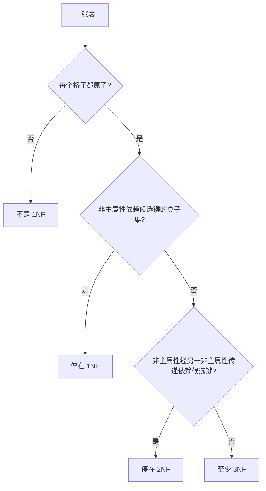

# 数据库范式 · 1NF / 2NF / 3NF（辨型过关）

> 第 9 章 · 上午选择高频；8 月末目标「范式能对」  
> 来源：2026-08-17 · 辨型 5 题过关（第 1 题口径订正：考试写「不满足 1NF」，不写 0NF）  
> 开场：[01-database-entry](../09-database/01-database-entry.md) · [交接看板](./01-learning-logs.md)

---

## 总口令

```text
1NF：格子里不能再拆（原子）
2NF：非主属性不能只靠主键的一部分（消除部分依赖）
3NF：非主属性不能靠另一个非主属性（消除传递依赖）
单列主键 ⇒ 没有「一部分」可依赖 ⇒ 已经是 2NF
```

---

## 梯子



---

## 一、先会这几个词

| 词 | 人话 |
|----|------|
| **函数依赖** `X → Y` | 知道 X，Y 就唯一确定 |
| **候选键** | 能唯一确定整行、且没有多余属性的一组 |
| **主键** | 选出的那一个候选键 |
| **主属性** | 出现在**任一**候选键里的属性 |
| **非主属性** | 不在任何候选键里 |

```text
完全依赖：靠整个键，拆开就不行
部分依赖：只靠键的一部分就够了
传递依赖：X → Y 且 Y → Z（Y 决定不了 X）⇒ X 间接决定 Z
```

---

## 二、三级分别消灭什么

| 级 | 前提 | 再要求 | 题干信号 |
|----|------|--------|----------|
| **1NF** | — | 属性原子，无重复组 | 一格里塞名单、数组、「张三/李四」 |
| **2NF** | 已是 1NF | 非主属性**完全**依赖每个候选键 | 复合主键 + 姓名只跟学号走 |
| **3NF** | 已是 2NF | 非主属性**不传递**依赖候选键 | 学号→系号→系主任 |

BCNF（了解即可）：每个决定因素都是候选键。3NF 仍可能因**主属性之间**的依赖而不满足 BCNF；C 档不挡过关。

---

## 三、一条龙例题（选课）

关系：**选课**(学号, 姓名, 系编号, 系名, 系主任, 课程号, 成绩)

事实：

- 一个学生一个系；一个系一个主任
- 一门课一个学生一个成绩
- 姓名由学号决定（考试简化，不管重名）

依赖：

```text
学号 → 姓名, 系编号
系编号 → 系名, 系主任
(学号, 课程号) → 成绩
```

候选键是 **(学号, 课程号)**：成绩必须两个都知道；其余都能由学号推出来。

### 最高到几范式？

| 问 | 答 |
|----|-----|
| 1NF？ | 是（格子都原子） |
| 2NF？ | **否**。姓名、系编号、系名、系主任都只依赖**学号**（键的真子集）→ **部分依赖** |
| 成绩呢？ | 完全依赖 (学号, 课程号)，这一列没问题 |

所以整表停在 **1NF**。

### 分解到 2NF

把「只跟学号走」的列拆出去：

```text
学生(学号, 姓名, 系编号, 系名, 系主任)     主键：学号
选课(学号, 课程号, 成绩)                   主键：(学号, 课程号)
```

选课：非主属性只有成绩，完全依赖复合键 → 已 3NF。  
学生：主键是**单列**，没有部分依赖 → **已是 2NF**；但 `学号 → 系编号 → 系名/系主任` → **传递依赖**，不是 3NF。

### 分解到 3NF

```text
学生(学号, 姓名, 系编号)     主键：学号
系(系编号, 系名, 系主任)     主键：系编号
选课(学号, 课程号, 成绩)     主键：(学号, 课程号)
```

### 为什么要拆（三种异常）

根因就一句：**两件不该绑在一起的事，被塞进同一张表、同一行。**  
「选课」是一件事，「这个系谁当主任」是另一件事。绑在一起后，做 A 就会误伤 B。

当前表主键是 (学号, 课程号)，所以**每一行必须是「某学生选了某课」**。系主任只是顺便写在这一行上。

```text
学号  姓名  系编号  系名    系主任   课程号  成绩
S01   张三  D1     计算机  王教授   C01     90
S01   张三  D1     计算机  王教授   C02     85
S02   李四  D1     计算机  王教授   C01     78
S03   王五  D2     数学    赵教授   C03     92
```

**插入异常**：想登记「D3 物理系，主任孙教授」，但还没有学生、没有选课。  
主键缺学号/课程号，插不进合法行。要么造假学生，要么系信息没处放。  
人话：**想记 B，却被逼先造一条 A。**

**删除异常**：王五是数学系唯一的学生。删掉他的选课行（只想表达「他不选 C03 了」），表里最后一条带「D2 / 赵教授」的行也没了。  
人话：**删 A，B 被连带擦掉。**

**修改异常**：计算机系换主任，王教授 → 刘教授。表里计算机出现了 3 行，要改 3 次。漏改一行，同一系就会出现两个主任。  
人话：**一件事实存了很多份，改漏就自相矛盾。**

拆到 3NF 之后，系独立成表：

```text
系(系编号, 系名, 系主任)          ← 没学生也能插 D3
学生(学号, 姓名, 系编号)
选课(学号, 课程号, 成绩)          ← 删选课不影响系
```

换主任只改 `系` 表一行。

| 异常 | 信号 | 本例 |
|------|------|------|
| **插入** | 想记的事插不进 | 新系没学生 → 系主任没处放 |
| **删除** | 删一件带走另一件 | 最后一个学生走了 → 系没了 |
| **修改** | 同一事实改很多行 | 换主任要改该系每一行 |

---

## 四、易混三刀

| 对比 | 怎么分 |
|------|--------|
| 部分 vs 传递 | 部分 = 依赖**键的一部分**（复合键才可能有）；传递 = 依赖**另一个非主属性** |
| 1NF vs 2NF | 一格多值 → 还不是 1NF；原子了但姓名跟着学号走 → 1NF 不是 2NF |
| 单主键陷阱 | 主键只有一列 ⇒ **不可能部分依赖** ⇒ 至少 2NF；再看有没有传递 → 是否 3NF |

---

## 五、已过关例题

| # | 场景 | 答 |
|---|------|-----|
| 1 | 联系人一格「张三/李四」 | **不满足 1NF**（格子不原子）。考试不写 0NF |
| 2 | (订单号, 商品号) 主键，商品号 → 商品名 | **1NF**；部分依赖，不是 2NF |
| 3 | 工号单主键，工号 → 部门号 → 部门电话 | **2NF**（单列主键无部分依赖）；传递依赖，不是 3NF |
| 4 | 第 3 题拆 3NF | 职工(工号, 姓名, 部门号) PK=工号；部门(部门号, 部门电话) PK=部门号 |
| 5 | 新系没学生，登记不了系主任 | **插入异常** |

---

## 下一步

开场白：「开始第 9 章，ER 模型」——实体 / 联系 / 1:1、1:n、n:m，再转到关系模式。
