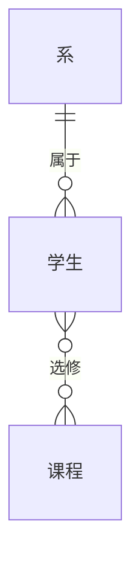

# ER 模型（辨型过关）

> 第 9 章 · 上午认图 + 下午 ER → 关系模式  
> 来源：2026-08-18 · 辨型 5 题全对  
> 开场：[01-database-entry](../09-database/01-database-entry.md) · 前置：[30 范式](./30-normalization-tutorial.md)

---

## 总口令

```text
矩形=实体（一张表的胚子）；菱形=联系（谁和谁有关系）
1:1 外键随便放（常放必有的那端）
1:n 外键放 n 端
n:m 联系自己成一张表，两边主键合成复合键
联系上的属性：1:n 跟 n 走；n:m 跟联系表走
```

---

## 一、三件套

| 构件 | 图上 | 人话 | 转表 |
|------|------|------|------|
| **实体** | 矩形 | 要存档的对象：学生、课程、系 | 一张表 |
| **属性** | 椭圆（主键下划线） | 对象有哪些字段 | 表的列 |
| **联系** | 菱形 | 实体之间的事：属于、选修 | 看基数，不一定单独成表 |

和类图的分界：ER 只关心**数据怎么存**，没有方法、没有接口。类图的 `1..*` 很像基数，但 **n:m 在 ER 必须拆出一张联系表**。

---

## 二、基数（考试认这三种）

```text
1:1  一人一座工位
1:n  一个系多名学生（学生端是 n）
n:m  学生选多门课，一门课多名学生
```

读法：看**对面**——一个学生能对应几个系？只能 1 个 → 学生在 n 端、系在 1 端。



`属于` 是 1:n；`选修` 是 n:m（成绩属于这次选修，不是学生本人的固有属性）。

---

## 三、转关系模式（下午核心）

| 基数 | 怎么转 | 本例 |
|------|--------|------|
| 实体 | 实体 → 表，标识属性 → 主键 | `系(系编号, 系名)` |
| **1:n** | **n 端**加 1 端主键当外键 | `学生(..., 系编号)` |
| **n:m** | **新表**：两主键合成复合键 + 联系属性 | `选修(学号, 课程号, 成绩)` |
| **1:1** | 任选一端加对方主键当外键 | 工位号放进职工表，或工号放进工位表 |

选课转完就是范式课里那三张表：

```text
系(系编号, 系名, 系主任)           主键：系编号
学生(学号, 姓名, 系编号)           主键：学号；系编号 FK
课程(课程号, 课程名)               主键：课程号
选修(学号, 课程号, 成绩)           主键：(学号, 课程号)
```

### 弱实体（认即可）

**强实体**：自己就有全局唯一标识。学生有学号，不靠别人也能指出是谁。  
**弱实体**：自己那点属性**不够唯一**，必须挂在某个主人（强实体）身上才分得清。

订单明细就是弱实体：它不是「世界上第 1 行货」，只是「这张订单里的第 1 行」。

两张订单都从第 1 行开始编号：

```text
订单号  行号  商品   数量
1001    1     苹果   2
1001    2     香蕉   1
1002    1     牛奶   3      ← 又是行号 1
1002    2     面包   1
```

如果主键只有 `行号`：两行都是 `1`，主键冲突，也分不清是 1001 的苹果还是 1002 的牛奶。  
`行号` 只在**一张订单内部**唯一，叫部分键（分辨符）。完整主键必须是：

```text
订单(订单号, ...)                      主键：订单号          ← 强实体
订单明细(订单号, 行号, 商品号, 数量)    主键：(订单号, 行号)  ← 弱实体
```

两层意思绑在一起：

1. **标识依赖**：单靠自己认不出是哪一行，要带上主人的键。  
2. **存在依赖**：没有订单 1001，就不该有「1001 的第 1 行」。删订单，明细必须跟着没（和类图里的**组合**同一直觉：房子拆了房间无意义）。

反例：如果每条明细都有全局 `明细号`（10001、10002…），它就能独立标识，是**强实体**，主键用 `明细号` 即可，`订单号` 只当外键。弱不弱，看它**有没有自己的全局身份证**。

考试信号：题干写「无独立标识 / 部分键 / 依赖某某存在」→ 弱实体；转表主键 = **主人主键 + 部分键**。

---

## 四、易混三刀

| 对比 | 怎么分 |
|------|--------|
| 属性在实体 vs 在联系 | 成绩随「这次选修」变，不随学生一个人变 → 联系属性 |
| 1:n 要不要联系表 | **不要**。外键塞进 n 端就够；再造一张「属于」表是多余的 |
| ER vs 类图 | ER 无方法；n:m 必须成表。类图可以只标 `*` 不拆表 |

---

## 五、已过关例题

| # | 场景 | 答 |
|---|------|-----|
| 1 | 一系多学生，一学生一系 | **1:n**；外键放**学生表** |
| 2 | 学生↔课程 n:m，成绩属选修 | **3 张**：学生、课程、选修；成绩在**选修表** |
| 3 | 一人一座工位 | **1:1**；不必单独建「拥有」表，外键放任一端 |
| 4 | 成绩为何不放学生表 | 成绩还依赖选了哪门课，是**联系属性** |
| 5 | 明细只有行号、必须挂订单 | 弱实体；主键 **(订单号, 行号)** |

---

## 六、真题外坑：外键认值域不认名字（2026-09-02 邮件客户端真题教训 · 13/15）

> 2024 上半年试题四首做：联系类型 5/5、填空 4/4、主键 3/3，唯一系统性失分是外键漏 2。

1. **外键认「值域」不认「名字」**——属性取值若必须来自另一关系的主键（哪怕改了名），就是外键。真题例：`邮件.发件人地址` → `邮件帐号.邮件地址`，"化了妆的外键"
2. **1:n 转换的改名陷阱**——n 方持 1 方主键，但属性可以重命名；一个 1:n 联系可产生多个外键（发件人地址、收件人地址都指向邮件帐号）
3. **复合主键里引用别表的那半，双重身份**——既是主键成分也是外键（附件.邮件号）
4. **弱实体满分模板**——存在依赖（没有邮件附件无意义）+ 标识依赖（附件号仅在邮件内唯一，须结合邮件号标识）各一句

---

## 下一步

开场白：「开始第 9 章，SQL」——读懂 SELECT / JOIN / GROUP BY。
