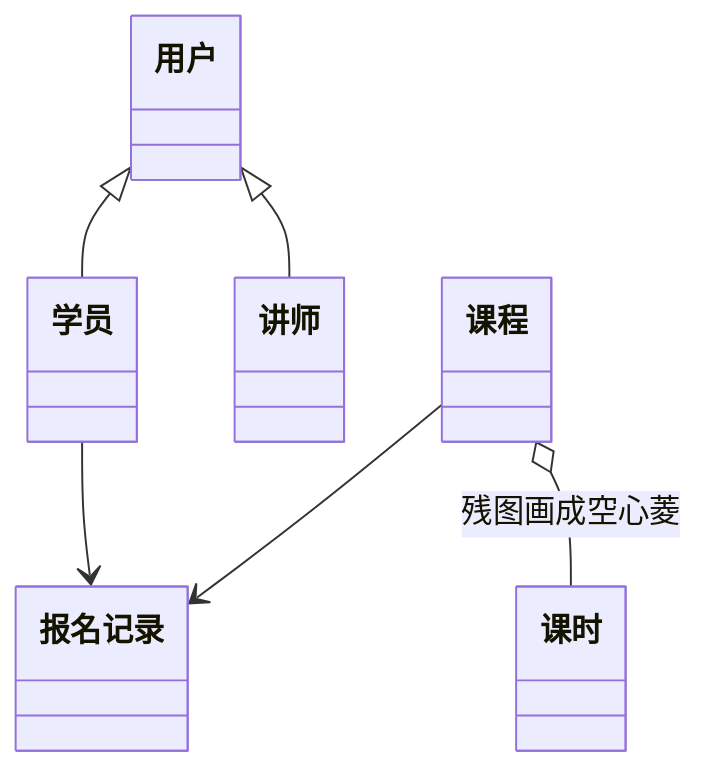
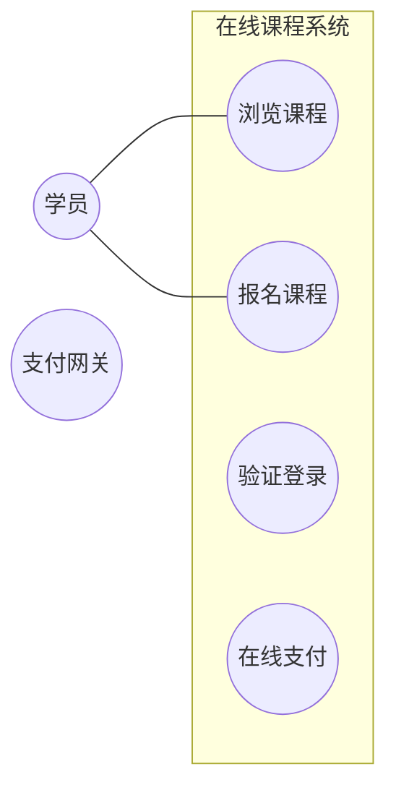

# 下午 UML 巩固演练（Mermaid 可视版）

> 2026-08-06 · 限时约 **25min**  
> **请用 Markdown 预览打开本文**，下面的图会渲染成类框/箭头（比 ASCII/表格具体）。  
> 答案：[07-uml-drill-answers.md](./07-uml-drill-answers.md)

---

## 业务说明

1. 学员可浏览、报名课程；报名产生报名记录。  
2. 一名学员 ↔ 多条报名记录；一门课程 ↔ 多条报名记录；一条记录只对 1 名学员、1 门课。  
3. 课程由课时组成；课时不能脱离课程存在。  
4. 讲师讲授课程（1 名讲师可讲多门课；1 门课 1 名主讲）。  
5. 学员、讲师都是一种用户。  
6. 报名课程必须先验证登录。  
7. 收费时报名可追加在线支付；免费不走支付。  
8. 在线支付经支付网关。

---

## 图 1 · 类图残片（预览可见）

> 故意保留一处画错、一处未画、一处缺多重性——和真题「残图」同类。



读图提示（真题不会写这些字，这里仅防编码看不懂）：

- `◁|--` 实线三角 = **泛化**（已画学员/讲师 → 用户）  
- `o--` 空心菱 = **聚合**（课程—课时，可能画错）  
- 实线箭头关联 = 学员/课程 到 报名记录（多重性未标）  
- 讲师与课程之间：**没有线**

### 作答

**C1.** 学员/讲师 → 用户 的泛化，对不对？  

**C2.** 课程—课时按说明应是什么？残图 `o--` 错在哪、怎么改？  

**C3.** 应在讲师与课程之间补什么关系？依赖 / 关联 / 泛化 / 组合  

**C4.** 多重性填空：

```text
学员 __ —— 报名记录 —— __ 课程
（从学员看报名记录个数；从课程看报名记录个数；
 再写：一条报名记录对学员 __ ，对课程 __）
```

或直接写成一行：`1 —— * —— 1` 那种完整式。

**C5.** 类 `报名服务` 仅有方法 `enroll(学员, 课程)`、无字段：对学员/课程画依赖还是关联？

---

## 图 2 · 用例图残片（预览可见）



（椭圆=用例；边界外=参与者。include/extend 需你按说明补上。）

### 作答

**U1.** 报名课程 与 验证登录：include 还是 extend？箭头从谁→谁？  

**U2.** 在线支付 与 报名课程：include 还是 extend？箭头从谁→谁？  

**U3.** 支付网关应连到哪个用例？  

**U4.** 要不要加「讲师」参与者？是/否 + 半句理由。

---

若预览里 Mermaid 没渲染：在 Cursor 打开本文件 → 右上 Preview；或告诉我，我改用**一张生成的类图图片**题。
